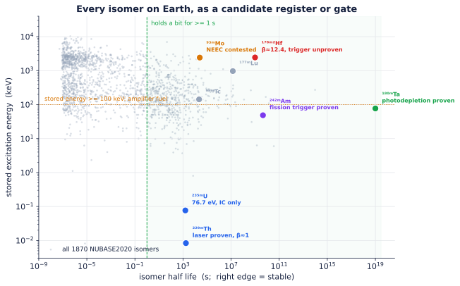
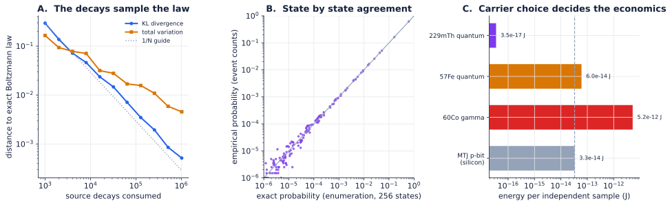
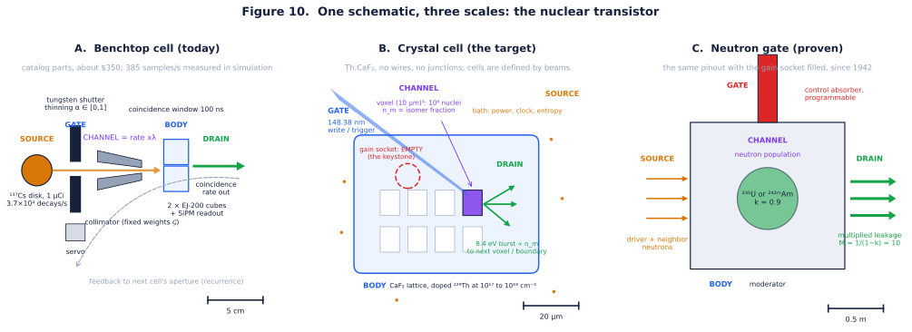
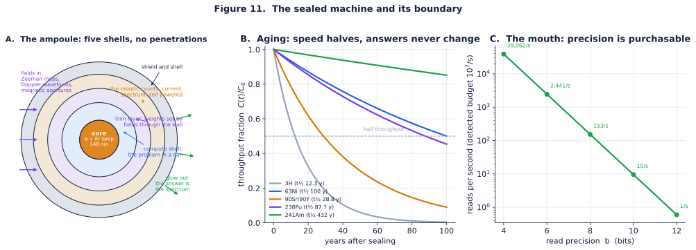
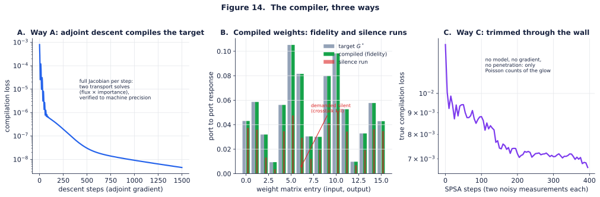

# Nuclear Compute

### Power, Logic, Memory, and Interconnect in One Radioactive Medium

**Max Freedom Pollard** · [ORCID 0009-0007-0059-3319](https://orcid.org/0009-0007-0059-3319)

Nuclear Compute proposes a new type of computer, distinct from classical, quantum, and photonic computing, in which a radiation field and the nuclear states it drives are themselves the processor, the memory, and the interconnect, and the decay of the same medium is the power supply.

> **Thesis.** A radiation field and the nuclear populations it drives are not a power source for a computer, not a data stream into a computer, and not one component of a computer. Together they *are* the computer: its logic, its memory, and its interconnect at once. A constant radioactive source supplies only what every machine needs and none computes with: power, clock, and entropy. Everything else (encoding, weighting, nonlinearity, memory, recurrence) happens inside the coupled radiation and matter field, with no conventional electronics in the loop.

It is called *nuclear* computing because the densest and most powerful realizations use nuclear scale quanta and states. But the object of study is compute, not any one device. We are after the model of computation, the gate algebra, and the physical limits, not a product.

A one line map of the argument:

> **substrate → dynamics → gate set → three roles → universality → sampling → physical limits → complexity ceiling → prior art → readiness and the keystone risk → falsifiable roadmap → a worked single bit machine.**

---

## The claim, stated plainly

Build nothing but a lump of structured matter, scatterers, absorbers, and a sparse lattice of addressable nuclei, and bathe it in radiation from a constant source. Shape the matter so that:

1. the geometry and scattering of the medium perform a continuous weighted sum of photon fluxes (a linear map, the *synapse*);
2. certain nuclei have cross sections that depend on the local field, so that the probability of an interaction is a nonlinear, thresholded function of how much radiation is already present (the *gate*);
3. some nuclei hold metastable (isomeric) states whose populations persist and store the result, written by a resonant pump, held for the isomer's lifetime, and read out either by triggering a detectable emission burst or by a nondestructive resonant probe that senses occupancy without erasing it (the *memory*);
4. output quanta reenter the medium, closing the loop so the field relaxes to a fixed point or samples a probability distribution (the *recurrence*).

If those four things can be arranged, the lump computes. The radiation that flows through it is doing the arithmetic; the nuclei that flip are holding the variables; the photon traffic between sites is the wiring. The source in the corner is just keeping the lights on.

The rest of this document makes each clause precise, identifies which clauses are routine physics and which one is not, and shows that the whole question of viability collapses onto clause (2): the gate.

---

## Why it is feasible now: three results that removed the impossibilities

Three independent experimental lines, all from 2014 or later and several from 2024 or later, have quietly removed the objections that would have made this proposal science fiction a decade ago:

- **Nuclear states are now optically addressable at room temperature.** In 2024 the absolute frequency of the ²²⁹Th nuclear transition was measured directly with a vacuum ultraviolet frequency comb locked to a strontium optical clock: ν_Th = 2,020,407,384,335(2) kHz, i.e. 8.355733(8) eV, near 148.38 nm, in a CaF₂ crystal at room temperature ([Nature 2024](https://www.nature.com/articles/s41586-024-07839-6); [NIST](https://www.nist.gov/news-events/news/2024/09/major-leap-nuclear-clock-paves-way-ultraprecise-timekeeping)). A nucleus you can write and read with a laser is a memory cell and a candidate neuron.
- **Single nuclear γ photons can be coherently shaped at room temperature.** Recoilless (Mössbauer) transitions retain quantum coherence in bulk solids, and the waveform of an individual γ photon has been coherently controlled ([Nature 2014](https://www.nature.com/articles/nature13018)); hard X ray photon wavepackets can be stored in a nuclear quantum memory ([Science Advances](https://www.science.org/doi/10.1126/sciadv.adn9825)). Trade publications already call this a route to ["nuclear quantum computers"](https://physicsworld.com/a/gamma-ray-shaping-could-lead-to-nuclear-quantum-computers/).
- **Probabilistic hardware is now real silicon.** Magnetic tunnel junction probabilistic Ising machines (250 junctions, about 10× faster and about 10× more energy efficient than a GPU on the right problems; about 33 fJ/bit) show that *sampling in hardware* is a competitive paradigm ([Nature Communications 2026](https://www.nature.com/articles/s41467-026-72020-8)). Nuclear computing's stochastic tier (below) is the same paradigm with a *native, truly random, self powered* source instead of an engineered noisy transistor.

None of these *is* a nuclear computer. Each removes one classic "impossible." What remains genuinely unproven is exactly one thing, and it is the gate.

---

## The substrate: what holds the state

Two coupled physical fields carry all state. There is no third register.

- Radiation field φ(𝐫, 𝛀, E, t), the occupation or flux of photon (and, in general, particle) modes at position 𝐫, direction 𝛀, energy E, time t.
- Nuclear field n_i(𝐫, t), the fraction of nuclei at 𝐫 occupying level i (ground, isomer, gateway).

A logical 1 is an occupied mode or an excited isomer; a logical 0 is an empty mode or a ground state nucleus. These binary labels are *emergent*, applied only after thresholding continuous rates and populations. The native physics is probabilistic, which is a feature, not a defect.

**The source is not data.** A constant activity λ produces a Poisson process N(t),

> `Pr[N(t+s) - N(t) = k] = (e^(-λ s)(λ s)ᵏ)/(k!),`

whose three gifts are power (every event is paid for by a decay), clock (the mean rate λ is a time unit; independent increments make any short interval an independent trial), and entropy (interarrival times are i.i.d. Exp(λ), true physical randomness, no pseudorandom generator). The raw stream carries no program. Programs are written by shaping interactions, by thinning, routing, shielding, and tuning cross sections, never by altering the source.

---

## The dynamics: the two equations that are a computer

All computation is the evolution of φ and n under standard radiation transport coupled to standard nuclear kinetics. What makes the pair a computer rather than a shielding calculation is that the cross sections depend on the fields.

Photon and particle transport (the wiring plus the weighted sum):

> `(1/c∂_t + 𝛀·∇)φ = - Σ_t(φ,n) φ + ∫ Σ_s(𝛀',E'→𝛀,E;φ) φ' d𝛀'dE' + q(n).`

Nuclear kinetics (the gate plus the memory):

> `ṅ_m = σ_p φ n_g - [λ_m + R_trig(φ_ctrl,n)] n_m, q ∝ β R_trig(φ_ctrl) n_m.`

Here Σ_t is the total macroscopic cross section, Σ_s the scattering kernel, q(n) the emission from nuclear deexcitation; n_m is the metastable (isomer) population, n_g the ground fraction, σ_p the pump cross section, λ_m the spontaneous decay rate, β the branching or cascade multiplicity, and R_trig the field triggered release rate, the term that turns physics into logic.

Two parts, two computational meanings:

- **Linear part is the synapse.** When cross sections are momentarily frozen, transport is linear: φ_out = 𝒢 φ_in, where 𝒢 is the Green's function of the Boltzmann operator. 𝒢(𝐫,𝛀,E;𝐫',𝛀',E') *is* a continuous weight matrix. Geometry and material set the weights. This is a weighted sum machine and it is textbook (MCNP, Geant4, and FLUKA compute 𝒢 routinely).
- **Nonlinear part is the gate.** The dependence of Σ_t(φ,n) and R_trig(φ) on the local field supplies the sigmoidal or threshold response that no linear machine can. This is where the theory concentrates all its risk.

---

## The gate set: the crux of the entire program

> A gate is any interaction whose probability or rate depends on the local radiation field. The universal primitive is
> `φ_out = g(Σ_j w_j φ_j),`
> with weights w_j realized by geometry, material, or resonance and g sigmoidal or hard thresholded.

Four physical gates realize a functionally complete, learnable set. Three are routine. The fourth decides everything.

### AND or multiply: the coincidence gate *(routine)*

Two independent Poisson streams of rate λ_1, λ_2 are routed to the same interaction volume with coincidence window τ_w. The chance coincidence (joint event) rate is the standard nuclear instrumentation result

> `λ_AND ≈ τ_w λ_1 λ_2, P_AND(Δ t) = 1 - e^(-τ_w λ_1 λ_2 Δ t).`

Encode x,y∈[0,1] by thinning the source to rates xλ, yλ (thinning theorem); the output rate is proportional to xy. This is a physical multiplier, and γγ coincidence counting is done in every nuclear lab on Earth. Independence is exact, from the independent increments property, so a *single* source yields arbitrarily many decorrelated streams by time slicing (Appendix B.1).

### MUX or weighted add: the scattering gate *(routine)*

Weighted addition is just the linear part of transport. A photon scattered into one of several modes, or routed through a geometric split, produces an output whose rate is a convex combination of inputs. Signed weights come from complementary pairs: an excitatory on resonance channel and an inhibitory detuned channel. This is the Green's function 𝒢 used deliberately. One honesty note on programmability: weights written by geometry are set at fabrication, and run time reprogramming is limited to apertures, absorber positions, and Doppler tuning, so a given lump is a fixed function machine reprogrammed mechanically, not electronically.

### NOT or complement: the absorption gate *(routine)*

A strong absorber removes fraction p of a stream; the survivors encode 1-p. Make p depend on a second field (for example a control beam that bleaches or populates the absorber) and you have an element that behaves like a controlled NOT. Off resonant or Doppler detuning gives the complement directly.

### Threshold or neuron: the triggered release gate *(the keystone)*

The only gate that supplies hard threshold with gain, and the only one not yet experimentally nailed down. An isomer stores energy; a control field of flux φ_ctrl triggers its release at rate R_trig = σ_trig φ_ctrl, dumping a cascade of β output quanta. Candidate mechanisms:

- NEEC (nuclear excitation by electron capture): a free electron is captured into an atomic vacancy while its kinetic energy lifts the nucleus over a gateway, releasing a cascade. Predicted to dominate XFEL driven isomer depletion by more than 10⁶× over direct photoexcitation (Gunst et al., PRL 2014). Status: contested. The 2018 ⁹³ᵐMo claim ([Nature 2018](https://www.nature.com/articles/nature25483)) has not been cleanly reproduced, alternative (inelastic scattering) explanations and much lower theoretical rates have been advanced, and precision Penning trap and EBIT tests are underway ([arXiv 2025](https://arxiv.org/html/2501.05217v1)).
- IGE (induced γ emission): a resonant photon stimulates emission from a stored isomer such as ¹⁷⁸ᵐ²Hf (2.45 MeV, t½=31 yr), ¹⁸⁰ᵐTa, or ⁹³ᵐMo. Status: contested for every candidate with gain. The 1998 Hf "triggering" claim was never independently reproduced and is widely attributed to artifacts; detailed balance arguments make easy triggering implausible ([Wikipedia: hafnium controversy](https://en.wikipedia.org/wiki/Hafnium_controversy)). One photon trigger, however, is proven: photoactivation of ¹⁸⁰ᵐTa through gateway states at and above 1.01 MeV was demonstrated with measured integrated cross sections (Belic et al., *PRL* 83, 5242 (1999)). Its ledger is upside down, about 1 MeV spent per 77 keV stored, so it is the existence proof that photon triggered isomer release is real physics, and simultaneously the cautionary unit of energy accounting: a proven switch, an impossible amplifier.
- Saturable resonance *(routine)*: a resonant cross section bleaches at high flux, T(φ) = T_0 + (1-T_0) φ/(φ+φ_sat), a *soft* sigmoid with no net gain. Always available; gives a neuron, not an amplifier.
- ²²⁹Th *(routine, but β ≈ 1)*: the 8.4 eV isomer is laser writable and laser readable at room temperature. It is an excellent memory or qubit and soft threshold, but it releases about one low energy quantum per write: no photon number gain.

### The Keystone Gate Criterion

Reduce "is the gate viable?" to two measurable inequalities. Let η be the probability that a stored isomer is released by the control field before it leaks spontaneously during the gate window, and let Γ be the net photon gain of one gate evaluation:

> `η = (R_trig)/(R_trig + λ_m) = (σ_trig φ_ctrl)/(σ_trig φ_ctrl + λ_m), Γ = (β η)/(C_in)`

where C_in is the number of control quanta spent per trigger and β the cascade multiplicity. Two conditions:

1. Leak condition η > ½: the field must drive release faster than the isomer leaks, σ_trig φ_ctrl > λ_m.
2. Amplification condition Γ > 1: a working logic gate (one that can drive its successors and overcome readout and coincidence losses) must put out more usable quanta than it consumes, β η > C_in.

A gate that meets only the leak condition is a memory or neuron; a gate that meets both is a logic amplifier, the thing a scalable computer is built from. A third inequality, the rate condition R_trig ≳ f_gate, decides usefulness rather than existence and binds hardest for long lived isomers, whose tiny λ_m makes the leak condition flattering; it is derived, together with the engineering form of the criterion (required areal density, self absorption, the fan out collection tax, and what *level restoration* means for cascadability), in [theory/THEORY.md](theory/THEORY.md). The criterion is evaluated against nuclear data for every candidate, with required fluxes per facility, in [gates/](gates/).

### The central tension the criterion exposes

Plotting the criterion (figure above) makes the field's real problem visible, and it is not the one usually stated:

| State | Leak condition | Multiplicity β | Verdict |
|---|---|---|---|
| ²²⁹ᵐTh (8.4 eV, t½≈29 min) | easy, proven laser control | ≈ 1 | superb memory or qubit, *not* a logic amplifier |
| ⁹³ᵐMo (6.85 h) | plausible | 2.87 (ENSDF, see `/gates`) | NEEC trigger unconfirmed |
| ¹⁷⁸ᵐ²Hf (2.45 MeV, 31 yr) | leak trivially beaten | 12.4 (ENSDF, incl. the 1147 keV chain) | trigger contested, unproven |
| ¹⁸⁰ᵐTa (77 keV, stable) | leak trivially beaten | ≈ 1, and energy uphill | trigger proven (photoactivation, 1999); an amplifier never |
| ²⁴²ᵐAm (48.6 keV, 141 yr) | beaten 4000× over at reactor flux | fission: ∼ 3.3 n + ∼ 8 γ | trigger proven (σ_f ≈ 6.4 kb); both inequalities met, at reactor scale |

> **The keystone insight:** in the photon sector, the isomer with a *proven* trigger has no gain (β≈1), and the isomers with large gain (β≫1) have no proven trigger. Nuclear computing's make or break engineering problem is to find, or engineer, a single compact state that satisfies the leak condition *and* has β>1 *and* can drive its successors. Everything downstream (universality, sampling, the complexity tiers) is real physics *conditioned on that one cell existing*. It is the experiment this repository exists to settle.

A theory that locates all its risk in one falsifiable place, and says so, is stronger than one that spreads risk everywhere and admits it nowhere.

### The keystone already exists, at a scale nobody wants

Apply the criterion, with no new physics, to the fissile nucleus, and every inequality closes at once. ²³⁵U stores 202 MeV behind a fission barrier (λ_m = 3.1×10⁻¹⁷ s⁻¹: the leak condition is free); its trigger is thermal neutron capture at σ_f = 585 b, tabulated to four significant figures; its multiplicity is ν̄ = 2.43 neutrons plus about 7 prompt photons, for a gain per absorbed neutron of about 2.1; and it is level restoring, because fission neutrons are born fast at the same spectrum whatever triggered the fission, so outputs re trigger inputs with no conversion stage. ²⁴²ᵐAm closes the loop with the candidate table above: it is literally an isomer, and it is the one row in which trigger cross section, flux, and multiplicity are all *measured* quantities that satisfy both inequalities, at an ordinary reactor thermal column, with a margin of three orders of magnitude ([gates/experiment_menu.md](gates/experiment_menu.md)). The gate network mathematics exists too: a subcritical region of multiplication k<1 is a threshold amplifier of gain 1/(1-k), coupled region kinetics (Avery, 1958) is this theory's Green's function synapse with gain on the diagonal, and local absorbers program thresholds and vetoes, all of it strictly subcritical, standard reactor physics rearranged into computational language ([theory/THEORY.md](theory/THEORY.md), Section 4). Nature has even run the loop unattended: the Oklo natural reactors sustained self restoring triggered release networks two billion years before anyone asked permission.

None of this yields a computer anyone wants: a neutron gate is centimeters to meters of assembly wrapped in shielding and licensing, the constant source purity of this document's charter is preserved only in the steady state subcritical sense, and the energy per operation is grotesque by the honesty section below. What it yields is existence. The model of computation defined by the two governing equations is physically complete at one scale, with 1940s physics. The keystone program is therefore a *miniaturization* program, from meter scale neutron gates toward crystal scale photon gates, and not a search for whether the model can exist at all. That is a categorically stronger position, and it sharpens what the photon sector must deliver: not merely η > ½ and Γ > 1, but both *plus* level restoration, in a package that fits on a table.

---

## Radiation as all three roles at once

The thesis is that radiation is simultaneously the logic, the memory, and the interconnect. The two governing equations make this exact:

| Role | Physical carrier | Term in the dynamics | Status |
|---|---|---|---|
| Logic | photon and nucleus interactions with field dependent cross section | R_trig(φ), Σ_t(φ), coincidence | 3 of 4 gates routine; threshold gate is the keystone |
| Memory | isomer populations n_i (nonvolatile, analog, in place) | n_m in the kinetics equation | routine for ²²⁹Th; in memory by construction |
| Interconnect | the photon field φ as a penetrating, routable bus | 𝒢, the Green's function | routine (transport) |
| *(power, clock, entropy)* | *the source, the only thing that is not compute* | λ, q | routine |

There is no separate RAM (the nucleus that computes is the nucleus that remembers, true compute in memory) and no separate bus (the quanta that carry signals are the quanta that interact). Remove any one of φ, n_i, 𝒢 and you have deleted a load bearing part of the machine.

**How isomeric memory is actually written, held, and read.** A natural objection is that "a nuclear population" sounds too diffuse to be a usable register. It is not; the read and write physics is concrete:

- **Write.** A resonant pump (laser, X ray, or a gateway transition) drives the ground to isomer transition; the isomer fraction n_m *is* the stored value, set in analog by the pump fluence or switched digitally by gating the pump. For ²²⁹Th this is the demonstrated 148.38 nm VUV excitation.
- **Hold.** The isomer is metastable by construction, so the bit is nonvolatile for the isomer lifetime, from well under a second to seconds for ²²⁹Th, hours for ⁹³ᵐMo, 31 years for ¹⁷⁸ᵐ²Hf, and geologically stable for ¹⁸⁰ᵐTa. No refresh, no standby power.
- **Read, destructively.** A trigger field releases the isomer and the emitted γ or photon burst is counted; the burst intensity is proportional to n_m. (This *is* the threshold gate, used as a readout.)
- **Read, nondestructively.** An occupied isomer shifts the nucleus's resonant response (different transition energy, hyperfine structure, or nuclear charge radius), so a weak probe beam's absorption or fluorescence reports occupancy without erasing it. Mössbauer or nuclear resonance probing reads the level coherently.
- **Address.** Bits are distinguished by position (a focused beam picks a lattice site), by energy (different isomers resonate at different, well separated quanta, that is spectral addressing), or by host (different dopant isotopes in different microdomains). The register is intrinsically nanoscale and radiation hard because the state lives inside the nucleus.

---

## Universality

**Analog (continuous functions).** Drive a leaky integrate and fire site with Poisson input from the coincidence gate; in the diffusion limit the "membrane" is an Ornstein Uhlenbeck process and the first passage firing rate is the Siegert function Φ(μ,σ), a smooth sigmoid that *emerges*, undesigned, from the physics (figure). A layer of weighted sums (𝒢) followed by Φ satisfies the hypotheses of the Cybenko and Hornik universal approximation theorems: one hidden layer approximates any continuous function on a compact set to arbitrary accuracy.

**Digital (Turing).** NAND is coincidence followed by a high threshold veto (output HIGH unless both inputs are HIGH). Two mutually exciting sites form a bistable memory cell. The Poisson source is the clock. NAND plus unbounded memory plus clock implies Turing completeness. Both constructions consume the triggered release threshold gate for the threshold and veto, so digital universality, like everything else, rests on the keystone.

---

## Stochastic and sampling mode: where the substrate is most at home

Because randomness is native, the medium is a natural sampler. Encode values as rates (thinning); AND is multiply, MUX is scaled add, NOT is complement. Close the loop: a recurrent network whose sites accept proposals with probability σ(u_k), u_k = Σ_j W_kj z_j + b_k, obeys detailed balance (Appendix B.3) and converges to

> `p(z) ∝ exp(½ zᵀ W z + bᵀ z),`

a physical Boltzmann machine and Ising sampler. This is the same workload that magnetic tunnel junction probabilistic machines now beat GPUs on, but here the noise source is true, free, and self powered rather than an engineered low barrier transistor. Monte Carlo integration, Bayesian inference, and combinatorial optimization are the natural first applications, and they need only the *soft* threshold (saturable resonance, β≈1), so they are reachable *before* the keystone amplifier is solved.

This machine now runs, decay by decay, in [simulator/](simulator/): a frustrated 8 site instance converges to its exact Boltzmann law (KL divergence a few times 10⁻⁴ over all 256 states), draws an independent sample every 26 decays, reaches its true ground state in a median of 173 decays when annealed, and, at the 8.4 eV ²²⁹Th transition, costs about 945 times less energy per sample than the magnetic tunnel junction machine it is benchmarked against (3.5×10⁻¹⁷ J versus 33 fJ). The same machine on 1.25 MeV quanta is 158 times *costlier* per sample: the carrier decides the economics, exactly as the energy honesty section argues.

---

## Physical limits: three laws with real numbers

### Precision law (Poisson, Cramér Rao)

A rate estimated from N = rT counts has relative error 1/√N. For b bits,

> `N = rT ≥ 2²ᵇ .`

8 bit precision costs 65,536 counts; 16 bit costs about 4.3 billion. Precision in a Poisson medium is *bought with counts*, hence with time times activity.

### Throughput law

If each gate output must reach b bits and the network's whole event budget is the source activity λ, the sustained gate evaluation rate is bounded by

> `f_gate ≈ λ/(2²ᵇ) .`

This is the law that makes activity the master resource: low precision sampling is cheap at megabecquerel sources; high precision deterministic logic demands reactor class fluxes. It also says *spend bits where you need them*: keep most of the machine stochastic and low b, reserve high b for the few places it matters.

### Energy honesty, and the right metric

A megaelectronvolt γ carries 1.6×10⁻¹³ J, about 8 orders of magnitude above a modern CMOS switch and about 10⁸ above the Landauer limit. *Per operation, high energy nuclear logic is not cheap.* Three honest consequences:

1. **Use the lowest energy state that works.** The 8.4 eV ²²⁹Th transition (1.3×10⁻¹⁸ J), not MeV quanta, is the energetically sane carrier for *dense logic*. Reserve keV to MeV quanta for memory, interconnect, and the quantum tier.
2. The right figure of merit is not joules per operation but *ops per decay*, how much computation you extract from each event you were going to pay for anyway. The source's energy is sunk cost; maximizing ops per decay is the real optimization target.
3. **The advantage is not efficiency.** It is density (in memory, no von Neumann shuttling), radiation hardness (the machine is made of what destroys ordinary chips), room temperature quantum coherence, and self powered autonomy (a sealed source runs for the isotope's half life with no battery).

---

## Complexity tiers and the honest ceiling

| Tier | Mechanism | Class | Honest claim |
|---|---|---|---|
| 0 | decay timing only | TRNG (⊆ BPP) | not computation, entropy only (HotBits) |
| 1 | stochastic coincidence and threshold gates | BPP | practical wins on sampling and Ising; same niche as probabilistic bits, with native randomness |
| 2 | quantum DOF in emissions | BQP | rivals quantum computers, room temperature, continually replenished qubits |

Tier 2 levers (all experimentally seeded, none yet a computer): polarization entangled annihilation γ pairs, theoretically maximal, measured *stronger than separable but below maximal* on real detectors, with an open Pryce Ward versus Klein Nishina debate ([Sci. Rep. 2023](https://www.nature.com/articles/s41598-023-34767-8); [APS Physics 2024](https://link.aps.org/doi/10.1103/Physics.17.138)); Mössbauer coherence and coherent single γ control at room temperature ([Nature 2014](https://www.nature.com/articles/nature13018)); nuclear spin qubits addressed by γ or RF fields.

**Ceiling, stated up front.** The extended Church Turing thesis (quantum form) bounds *any* physical machine by BQP. Nuclear computing does not claim to exceed quantum computation. It claims a *different physical road to the same frontier*, one that may be far easier to engineer (no dilution refrigerator; intrinsic radiation tolerance; qubits delivered by the source). 

---

## Prior art, and the honest delta

| System | Uses radiation as | What it is *not* | Relation to this proposal |
|---|---|---|---|
| HotBits and decay TRNGs | entropy | not logic (Tier 0) | our clock and entropy layer only |
| RTGs, betavoltaics | power | not compute | our metabolism layer only |
| γγ coincidence spectrometers | a real multi stream gate | not programmable | proof our AND gate is real |
| NEEC, IGE, ²²⁹Th experiments | field controlled nuclear transitions | not a gate *network* | the keystone, in the lab |
| coupled reactor cores (Avery 1958) and subcritical assemblies | a real triggered release gain network | never framed or used as computation | the proven keystone at reactor scale; our coupling mathematics |
| Mössbauer and γ quantum optics | coherent nuclear states | not a processor | our Tier 2 substrate |
| MTJ probabilistic and Ising machines | (engineered noise, not radiation) | not self powered or truly random | our stochastic tier twin in silicon |
| Photonic and optical neural nets | (optical, not nuclear) | | share the 𝒢 math; we add nonvolatile nuclear memory plus MeV and quantum reach |

**The genuinely new claim:** *one physical substrate that is logic, memory, and interconnect at once, powered and clocked by its own decay, scaling from a free truly random sampler to a room temperature quantum processor*, with the entire question of feasibility honestly isolated in a single, named, falsifiable gate.

---

## Nomenclature

A new class of machine tends to be reached for under several names before one settles, and this document uses *Nuclear Compute* for the model and *nuclear computing* for the field. The same object is a nuclear computer or a radiative computer named for its substrate, a radioisotope computer or decay powered computer named for its metabolism, and, when packaged as a component in the way a CPU, GPU, or NPU is, a radioactive processing unit (RPU) or nuclear processing unit (NPU). Where the amplifying keystone gate is driven by a fission channel the machine is a fission computer (fission compute); where the driving neutrons come instead from a fusion source it is a fusion computer (fusion compute); the two share the neutron sector gate of Section 4 and differ only in what supplies the neutrons. Named for the mechanism that carries the state, it is variously isomer computing (isomeric nuclear memory), gamma ray or nuclear photonic computing, Mössbauer computing, and, in its native tier, stochastic nuclear computing. These are one machine under many names; the physics is in the sections above, not in the label.

---

## Technology readiness, and where the risk lives

Every component except one is either routine nuclear physics or recently demonstrated. The exception sits at maximum centrality and minimum readiness: the triggered release threshold gate with gain, the keystone. That single node is the theory's load bearing wall. The honest reading of this chart is the project's entire strategy: derisk the keystone first; everything else is integration.

---

## A falsifiable roadmap (with kill criteria)

**Phase A. Stochastic sampler (no keystone needed).** Build a recurrent stochastic network using only routine gates (coincidence AND, absorption NOT, scattering MUX, the *soft* saturable threshold, ²²⁹Th memory). Benchmark a small Ising or sampling problem against a magnetic tunnel junction probabilistic machine on energy per sample and ops per decay.
- *Kill criterion A:* if a native radiation sampler cannot match a probabilistic machine's quality on *any* problem class even in simulation, the stochastic tier has no niche.
- *Status: the simulation half is settled, affirmatively.* The digital twin in [simulator/](simulator/) samples its exact Boltzmann law at 26 decays per independent sample and beats the silicon benchmark on energy iff the carrier is the 8.4 eV transition. What remains of Phase A is hardware: the same measurement on a bench, with exempt quantity sources, detectors at the boundary only.

**Phase B. Settle the keystone.** Now two questions, one per sector.
- **B1, photon sector.** Measure (σ_trig, β, C_in) for the best NEEC or IGE candidate (precision EBIT or Penning trap NEEC; resonant IGE of a mid energy isomer) and locate it on the keystone figure. The required cross sections per facility are tabulated in [gates/experiment_menu.md](gates/experiment_menu.md); the ongoing nondestructive Penning trap test of the ⁹³ᵐMo claim largely decides this sector.
- **B2, neutron sector.** Existence is already answered by library data; what remains is architecture. Reproduce the two region NAND of coupled subcritical assemblies in OpenMC with ENDF data, all inputs public, everything at k<1: no laboratory required, and the coupling matrices, absorber programming, and clock rates it yields are inherited by the photon sector when its gate arrives.
- *Kill criterion B (the big one, now confined to B1):* if no compact state can be shown to satisfy the leak condition, Γ>1, *and* level restoration at any achievable flux, then nuclear computing at benchtop scale is permanently confined to the stochastic tier plus memory, a real but bounded result, and the amplifier tier remains a reactor scale curiosity. The theory's *high* ambition lives or dies here.

**Phase C. Tier 2 coherence.** Demonstrate a two qubit operation on Mössbauer or nuclear spin DOF, or a usable Bell measurement on annihilation γ pairs after Compton analysis.
- *Kill criterion C:* if coherence cannot survive realistic readout, Tier 2 collapses to the stochastic tier.

**Repository deliverables that feed this roadmap, all live:**

| directory | contents |
|---|---|
| [theory/](theory/) | full derivations, the engineering form of the keystone criterion (areal density, self absorption, collection, level restoration, reset, pile up), the reactor scale existence proof, keystone free Bernstein universality, the aging invariance theorem, and the boundary (I/O) theory |
| [gates/](gates/) | the criterion evaluated against NUBASE2020 and ENSDF for all 1870 known isomers; curated candidates with measured multiplicities; the experiment menu of required cross sections per facility |
| [transport/](transport/) | Monte Carlo demonstrations of every routine gate (exact coincidence multiplier, absorption complement, measured Green's matrix, saturable sigmoid, Bernstein universality), the degree checker, and the compiler: the adjoint assembler that turns a target weight matrix into a material layout, three ways |
| [simulator/](simulator/) | the digital twin: a Tier 1 machine run decay by decay, validated against exact enumeration, with decays per sample and energy per sample measured |
| [transistor/](transistor/) | the reference transistor: one pinout at three scales, the valve, the datasheet with characteristic curves and maximum ratings; with four accompanying notes: [SEALED.md](transistor/SEALED.md) (the machine), [EMBODIMENT.md](transistor/EMBODIMENT.md) (the build, at assembly grade), [VALVE.md](transistor/VALVE.md) (the logic), [COMPONENTS.md](transistor/COMPONENTS.md) (the full inventory of a working computer, missing pieces simulated), [POWER.md](transistor/POWER.md) (the metabolism), and [SCALING.md](transistor/SCALING.md) (the trajectory) |

---

## A worked example: a single bit ²²⁹Th processor

A concrete, idealized realization that uses only demonstrated physics (no keystone gain, this is a memory or neuron in the stochastic tier):

- **Setup.** A Th:CaF₂ crystal between two scintillation detectors; a weak ⁶⁰Co source supplies a Poisson γ flux (clock, entropy, power); a tunable 148.38 nm VUV laser pumps ²²⁹Th into the 8.4 eV isomer (in crystal fluorescence lifetime about 630 s; vacuum half life about 1740 s, λ_m ≈ 4.0×10⁻⁴ s⁻¹).
- **Encode.** Isomer fraction n_m is the bit: laser on for a calibrated time writes 1; laser off lets spontaneous decay erase toward 0.
- **Threshold readout (neuron).** A control beam tuned to a gateway transition triggers release at rate R_trig∝φ_ctrl; choose φ_ctrl so the output burst is negligible when n_m is low and large when n_m is high. The output spike train *is* the read.
- **AND of two cells.** Feed the trigger beam outputs of cells A and B into a coincidence detector (window τ_w): λ_AND = (R_trig,A n_m,A)(R_trig,B n_m,B) τ_w, HIGH only when both are 1. A third isomer fed by this coincidence propagates the computation; a high threshold veto on it builds NAND.
- **Why it is computation, not randomness.** The source supplies tokens; the laser writes data; the isomer stores state; trigger beams and coincidence perform directed nonlinear operations on that state. Computation is the *evolution of the coupled fields under those rules*; timing alone (Tier 0) cannot do this, which is precisely why the gates are the theory.

---

## The unit you could hold: the nuclear transistor

Every computing technology earns belief when it can point at its unit, the one physical object that switches, stores, and tiles. For electronics that object is the transistor, and what makes a transistor buildable is not its physics but its *pinout*: gate, source, drain, channel, body. This machine has the same pinout, and it exists at three scales today, drawn side by side in the figure below and specified part by part, with prices, dimensions, and the honest gaps, in [the reference transistor](transistor/README.md).

| terminal | benchtop cell (today, about \$350) | crystal cell (the target) | neutron gate (proven) |
|---|---|---|---|
| GATE | shutter aperture α | 148.38 nm beam | control absorber |
| SOURCE | ¹³⁷Cs disk, 1 µCi | pump laser + source bath | driver and neighbor flux |
| DRAIN | coincidence rate out | 8.4 eV burst ∝ n_m | multiplied leakage |
| CHANNEL | encoded rate xλ | isomer fraction n_m | neutron population |
| BODY | scintillator | CaF₂ lattice | moderator |
| switching time | ms (servo aperture) | µs (Doppler) to ns (line response) | Λ/(1-k): gain × bandwidth = 1/Λ |
| gain | none (β ≈ 1) | the empty socket: the keystone | 1/(1-k), proven |

Read the last row left to right and it is the research program in one line: the benchtop cell needs no discovery, the crystal cell is complete except for the one socket this repository exists to fill, and the neutron gate has had gain since 1942. The analogy is load bearing, not decorative, and the device document proves it three ways: silicon's *body effect* already exists in the nuclear device as the isomer shift, measured since 1960; the *field effect* already runs on every Mössbauer bench as a coil or Doppler drive gating a γ ray channel (the valve, a pass transistor available today); and the subcritical gate obeys a constant gain bandwidth product M/τ_switch = 1/Λ (10 kHz thermal, 100 MHz fast), the op amp law, hiding in reactor kinetics. The full datasheet, characteristic curves, packing densities spanning fourteen orders of magnitude, and absolute maximum ratings are in [the reference transistor](transistor/README.md).

---

## The ampoule: the machine, sealed

Take the unit above, remove the wall socket, and ask what survives. The answer, worked out in [transistor/SEALED.md](transistor/SEALED.md) and computed line by line in [transistor/sealed_results.md](transistor/sealed_results.md), is a sealed radioactive processing unit (a nuclear processing unit, the RPU to a CPU's role): a vessel with no penetrations, an alpha core in high pressure krypton is a nuclear pumped 148 nm lamp, clock, and entropy source at once; the problem is ground into a compute shell as geometry; weights are trimmed *through the sealed wall* by Zeeman coils (about 0.7 natural linewidths per tesla on ⁵⁷Fe) and piezoelectric Doppler rings (one linewidth per 0.097 mm/s); and a betavoltaic layer harvests the same decay budget to power the boundary readout, so the machine pays for its own mouth. Problems enter as fields, answers leave as glow.

Two results, one negative and one positive, make the design honest:

- **The lamp cannot write.** The krypton excimer continuum lands, remarkably, on the ²²⁹Th line at 148.38 nm, but the arithmetic is fatal: a 1 GBq core delivers about one write quantum per 10⁸ nucleus voxel every five weeks, because the lamp's bandwidth exceeds the nuclear linewidth by eighteen orders of magnitude and no activity buys that back. Broadband self pumping of neV lines is dead, so the sealed machine computes in rates, not isomer populations, until a narrowline internal source or the keystone exists.
- **Rates are enough for more than expected.** Two additions to [theory/THEORY.md](theory/THEORY.md) carry the ampoule: the Bernstein construction (Section 6) proves any continuous function on [0,1] is computable feed forward by the three routine gates alone, no gain anywhere, verified gate by gate in [/transport](transport/results.md); and the aging invariance theorem (Section 7) proves that a degree homogeneous circuit's correctness is exactly activity invariant, so a sealed source's decay costs speed and never accuracy. The design rule is one line: compare like coincidence degree only with like.

The worked unit: one liter, 1 GBq of ⁹⁰Sr/⁹⁰Y, a 64 site annealer with its Ising instance etched in, about 38,000 independent samples per second at sealing, 8 bit readout at 153 reads per second through a 10⁷ event boundary budget, half of everything at year 29 with an identical stationary law, and an end of mission curve known in closed form on the day of manufacture. The boundary theory (Section 8: counts, currents, spectral channels, and a ceiling near 24 bits per detected quantum) prices every translation between the radiation native machine and the electronic world it reports to.

The lamp's failure carries its own repair, developed in [theory/THEORY.md](theory/THEORY.md) Section 9: the mismatch was a property of *atomic* light, and the inventory contains emitters that are not atomic. Parent isotopes emit their daughters' lines at natural width (the Mössbauer source principle: ⁵⁷Co for ⁵⁷Fe, ¹⁸¹W for ¹⁸¹Ta), ²³³U feeds ²²⁹ᵐTh directly with no photons at all (2 percent branch, a computed standing population of 2×10⁵ isomers per cm³), and field gradients turn tuning into *addressing* on the MRI principle, with ¹⁸¹Ta moving 42 linewidths per tesla: a millitesla addressed, microsecond latch, fed from inside. Section 10 completes the rate coded canon: the isolation lemma (every fan out is a fresh thinning, never a copy, and then error does not compound with depth at all), the one dial annealing schedule (Geman and Geman applies verbatim to the Poisson event clock), graceful degradation with onboard self calibration against a fixed nuclear line, and multi ampoule composition over energy multiplexed links.

The machine also now has its compiler (theory Section 11, demonstrated in [transport/compiler_demo.py](transport/compiler_demo.py)): the algorithm from a target weight matrix to a material layout, three ways. The adjoint identity ∂𝒢_io/∂ s_v = φ_i(v) ψ_o(v) (forward flux times importance, the reactor perturbation formula, which is also exactly what backpropagation is) yields the full Jacobian of the whole weight matrix from two transport solves, verified to machine precision; adjoint descent then compiles a random target to 0.65 percent from a blank plate. A crossbar fabric compiles any target by exact aperture arithmetic, and SPSA trims a sealed unit onto its instance from outside the wall using only Poisson counts of its own glow. "The problem is ground into the geometry" is no longer a slogan; it is a function you can call.

Where this all goes is the subject of [transistor/SCALING.md](transistor/SCALING.md), the ENIAC ledger: every component with its improvement lever, its physical ceiling, and whose industrial curve improves it for free (timing and collection ride PET and high energy physics; memory rides the nuclear clock laser program; sources ride isotope production). The machine starts nine orders of magnitude past ENIAC per operation on decay heat alone, and catalog technology, with no new physics, carries the sampler another five to six orders. The primitives are not placeholders: every lever multiplies the same counting, thinning, and coincidence the theory is written in.

---

## Open problems and how to contribute

1. **Keystone:** propose or measure a compact state meeting the leak condition with β>1 *in a level restoring or convertible class* (theory, Section 2). *This is problem number one.* A concrete, computable subproblem: search ENSDF for heterogeneous pairs of isomers whose cascade lines and gateway lines are mutually resonant (gate A's output pumps gate B and vice versa); the search space is already tabulated in `/gates`.
2. Tighten the throughput law for fan out reuse: when is a count "spent"?
3. A learning rule: aperture update Δα ∝ coincidence(pre,post) is Hebbian or STDP using the *same* coincidence primitive as the AND gate (Appendix B.4); formalize and simulate.
4. Transport level 𝒢 for a real geometry that implements a target weight matrix (signed weights via complementary channels).
5. Tier 2: a concrete two qubit gate on nuclear spin or Mössbauer DOF with a room temperature error budget.
6. **The addressed long retention write.** The broadband route to self written memory is dead by a bandwidth ratio of 10¹⁸, and the narrowline route is now open in principle (nuclear lamps, radiogenic feeding, resonance addressing: theory Section 9); what remains is a state that is simultaneously *parent fed, gradient addressable, and long lived*. A concrete, computable search: scan the catalog in `/gates` for isomers with lifetime above seconds whose feeding parents emit Mössbauer class lines, and rank by the addressing sensitivity Γ/(dE/dB).
7. Measure realized bits per detected quantum for a pixelated spectroscopic boundary against the log_2(N_E N_x N_τ) ceiling of the boundary theory.

Open an Issue stating the claim and the test; pair every Pull Request with the Issue it closes.

---

## References

²²⁹Th nuclear clock and optical control of nuclei
- Frequency ratio of the ²²⁹ᵐTh transition and the ⁸⁷Sr clock. *Nature* (2024): https://www.nature.com/articles/s41586-024-07839-6
- NIST, "Major leap for nuclear clock…" (2024): https://www.nist.gov/news-events/news/2024/09/major-leap-nuclear-clock-paves-way-ultraprecise-timekeeping
- JILA, frequency reproducible nuclear clock: https://jila.colorado.edu/news-events/articles/frequency-reproducible-nuclear-clock
- Reproducibility of solid state ²²⁹Th clocks. arXiv 2507.01180 (2025): https://arxiv.org/html/2507.01180v1

NEEC, IGE, and triggered release (including disconfirming evidence)
- Chiara et al., "Isomer depletion as evidence of NEEC." *Nature* 554, 216 (2018): https://www.nature.com/articles/nature25483
- ⁹³ᵐMo beam based NEEC. *PRL* 122, 212501 (2019): https://journals.aps.org/prl/abstract/10.1103/PhysRevLett.122.212501
- Nondestructive NEEC test via precision mass spectrometry. arXiv 2501.05217 (2025): https://arxiv.org/html/2501.05217v1
- Gunst et al., NEEC dominance in XFEL isomer depletion. *PRL* (2014).
- Induced gamma emission, Wikipedia: https://en.wikipedia.org/wiki/Induced_gamma_emission
- Hafnium controversy (the cautionary tale), Wikipedia: https://en.wikipedia.org/wiki/Hafnium_controversy

Nuclear and γ ray quantum optics
- Vagizov, Kocharovskaya et al., coherent control of recoilless γ photon waveforms. *Nature* 508, 80 (2014): https://www.nature.com/articles/nature13018
- Nuclear quantum memory for hard X ray photon wavepackets. *Science Advances*: https://www.science.org/doi/10.1126/sciadv.adn9825
- "Gamma ray shaping could lead to nuclear quantum computers," *Physics World*: https://physicsworld.com/a/gamma-ray-shaping-could-lead-to-nuclear-quantum-computers/

Entangled annihilation photons (Tier 2)
- Testing entanglement of annihilation photons. *Scientific Reports* (2023): https://www.nature.com/articles/s41598-023-34767-8
- "PET could be aided by entanglement," *APS Physics* (2024): https://link.aps.org/doi/10.1103/Physics.17.138
- Nonmaximal entanglement measured on a plastic PET scanner, PMC: https://pmc.ncbi.nlm.nih.gov/articles/PMC12042903/

Probabilistic and Ising hardware (stochastic tier comparison)
- 250 MTJ probabilistic Ising machine. *Nature Communications* (2026): https://www.nature.com/articles/s41467-026-72020-8 (preprint arXiv 2506.14590)

Foundational (classical, by name)
- G. Cybenko (1989), K. Hornik (1991), universal approximation. A. Siegert (1951), first passage firing rate. B. Gaines (1967), stochastic computing. K. Camsari and S. Datta, probabilistic bits. Nuclear data: ENDF/B, JEFF, JENDL, TENDL, ENSDF, EXFOR. Transport codes: MCNP, Geant4, FLUKA, PHITS.

---

## Appendix A. Notation

| Symbol | Meaning |
|---|---|
| φ(𝐫,𝛀,E,t) | radiation (photon or particle) field, flux or occupation |
| n_i(𝐫,t) | nuclear population fraction in level i |
| λ | source activity (Poisson rate) |
| λ_m | spontaneous decay rate of the isomer (=ln 2 / t½) |
| σ_p, σ_trig | pump and trigger cross sections |
| R_trig=σ_trigφ_ctrl | field driven release rate |
| β | cascade multiplicity (output quanta per release) |
| C_in | control quanta consumed per trigger |
| η, Γ | trigger efficiency; net photon gain |
| 𝒢 | Green's function of the transport operator (the synapse) |
| τ_w | coincidence window |

## Appendix B. Derivation sketches

**B.1 Independent streams from one source.** A Poisson process has independent increments; disjoint time slices are independent, and marking or thinning preserves the Poisson property. Hence one physical source yields arbitrarily many decorrelated input streams, no second source and no pseudorandom generator.

**B.2 Coincidence multiply.** For two independent streams with windows τ_w, the joint event (chance coincidence) rate is τ_wλ_1λ_2 to leading order; the survival form is P=1-e^(-τ_wλ_1λ_2Δ t). With λ_i = x_iλ, output is proportional to x_1 x_2.

**B.3 Boltzmann stationarity.** Single site flips with acceptance σ(u_k)=1/(1+e^(-u_k)), u_k=Σ_j W_kjz_j+b_k, satisfy detailed balance with respect to p(z)∝exp(½ zᵀ W z + bᵀ z) for symmetric W.

**B.4 Hebbian aperture rule.** Δα_ij∝ coincidence rate(pre_i, post_j) reuses the coincidence primitive (the AND gate) as a local learning rule; the gate and the synapse update are the *same* physical event.

## Appendix C. Candidate states (computed from NUBASE2020 and ENSDF in [gates/](gates/); β values are summed ENSDF intensities, leverage is energy released per trigger quantum spent)

| State | Energy | t½ | λ_m (s⁻¹) | β | Leverage | Role | Trigger status |
|---|---|---|---|---|---|---|---|
| ²²⁹ᵐTh | 8.355733(8) eV | about 29 min (vac.) | 4.0×10⁻⁴ | 1 | 1 | memory or qubit, soft threshold | proven (laser) |
| ²³⁵ᵐU | 76.7 eV | 26 min | 4.4×10⁻⁴ | 1 | | second ultra low energy memory; decays by internal conversion, lifetime is chemistry sensitive | none demonstrated |
| ⁹³ᵐMo | 2.425 MeV | 6.85 h | 2.8×10⁻⁵ | 2.87 | ≈ 500 (4.85 keV gateway) | candidate logic, best energy leverage in the photon sector | NEEC contested |
| ¹⁷⁸ᵐ²Hf | 2.446 MeV | 31 yr | 7.1×10⁻¹⁰ | 12.4 | ≈ 245 (at 10 keV) | high gain logic | IGE contested |
| ¹⁸⁰ᵐTa | 77 keV | stable | 0 | ≈ 1 | 0.076 | proof that photon triggering is real; energy uphill | photoactivation proven (1999) |
| ²⁴²ᵐAm | 48.6 keV | 141 yr | 1.6×10⁻¹⁰ | ∼ 11 | 8×10¹² (fission channel) | the bridge: an isomer whose proven trigger opens fission | proven (σ_f≈6.4 kb thermal) |
| ¹⁷⁷ᵐLu | 970 keV | 160 d | 5.0×10⁻⁸ | 5.85 | | high K storage | none demonstrated |
| ⁵⁷Fe | 14.4 keV | 98 ns | 7×10⁶ | 1 | 1 | Mössbauer, Tier 2 coherence, directional interconnect | routine |
| ²³⁵U (n,f) | 202 MeV released | | | 2.43 n + ∼ 7 γ | 8×10¹² | the proven keystone, reactor scale | proven (585 b thermal) |
| ⁹Be (n,2n) | | | | 2 | | neutron multiplier without fissile material; convertible, not self restoring | proven (threshold 1.85 MeV) |

The full catalog (1870 isomeric states: 585 hold a bit for a second, 50 for a day, 38 of those store over 100 keV) is in [gates/isomer_catalog.csv](gates/isomer_catalog.csv), regenerated by [gates/isomer_screen.py](gates/isomer_screen.py).

---

## License and citation

Prose and figures are CC BY 4.0; code is MIT (see [LICENSE](LICENSE) and [LICENSE-DOCS](LICENSE-DOCS)). Cite via [CITATION.cff](CITATION.cff). Contributions follow the rule above: open an Issue stating the claim and the test, and pair every Pull Request with the Issue it closes.

---

*The supporting physics is settled. The keystone gate is proven at reactor scale and unproven at crystal scale. Shrinking it is the whole game.*
