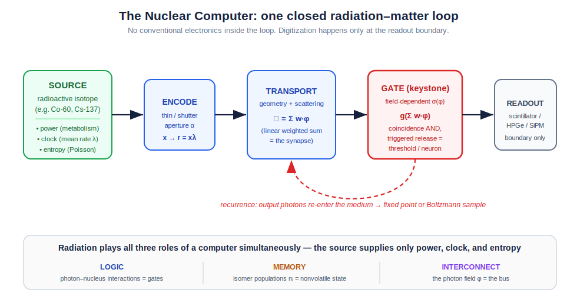
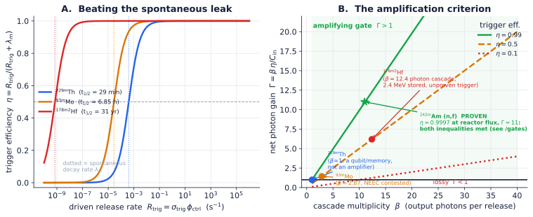
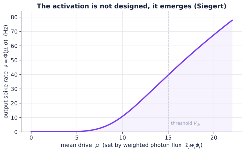
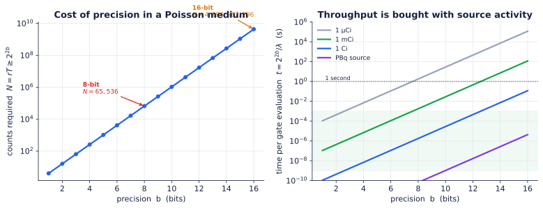
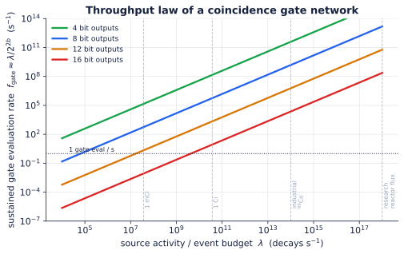
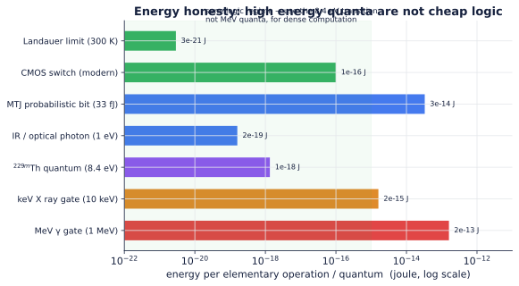
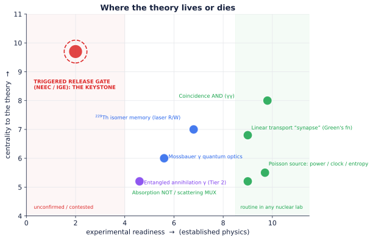

# Nuclear Computing

### A new model of computation in which radiation is the computer

Nuclear Computing proposes a new type of computer — distinct from classical, quantum, and photonic computing — in which a radiation field and the nuclear states it drives are themselves the processor, the memory, and the interconnect.

> **Thesis.** A radiation field and the nuclear populations it drives are not a power source for a computer, not a data stream into a computer, and not one component of a computer. Together they *are* the computer — its logic, its memory, and its interconnect at once. A constant radioactive source supplies only what every machine needs and none computes with: power, clock, and entropy. **Everything else — encoding, weighting, nonlinearity, memory, recurrence — happens inside the coupled radiation–matter field, with no conventional electronics in the loop.**

It is called *nuclear* computing because the densest and most powerful realizations use nuclear-scale quanta and states. But the object of study is **compute**, not any one device. We are after the model of computation, the gate algebra, and the physical limits — not a product.

A one-line map of the argument:

> **substrate → dynamics → gate set → three roles → universality → sampling → physical limits → complexity ceiling → prior art → readiness & the keystone risk → falsifiable roadmap → a worked one-bit machine.**

---

## The claim, stated plainly

Build nothing but a lump of structured matter — scatterers, absorbers, and a sparse lattice of addressable nuclei — and bathe it in radiation from a constant source. Shape the matter so that:

1. the **geometry and scattering** of the medium perform a continuous weighted sum of photon fluxes (a linear map — the *synapse*);
2. certain **nuclei have cross-sections that depend on the local field**, so that the probability of an interaction is a nonlinear, thresholded function of how much radiation is already present (the *gate*);
3. some nuclei hold **metastable (isomeric) states** whose populations persist and store the result — written by a resonant pump, held for the isomer's lifetime, and read out either by triggering a detectable de-excitation burst or by a non-destructive resonant probe that senses occupancy without erasing it (the *memory*);
4. **output quanta re-enter the medium**, closing the loop so the field relaxes to a fixed point or samples a probability distribution (the *recurrence*).

If those four things can be arranged, the lump computes. The radiation that flows through it is doing the arithmetic; the nuclei that flip are holding the variables; the photon traffic between sites is the wiring. The source in the corner is just keeping the lights on.

The rest of this document makes each clause precise, identifies which clauses are routine physics and which one is not, and shows that the whole question of viability collapses onto clause (2): **the gate.**

---

## Why it is feasible now: three results that removed the impossibilities

Three independent experimental lines, all post-2014 and several post-2024, have quietly removed the objections that would have made this proposal science fiction a decade ago:

- **Nuclear states are now optically addressable at room temperature.** In 2024 the absolute frequency of the $^{229}$Th nuclear transition was measured directly with a vacuum-ultraviolet frequency comb locked to a strontium optical clock: $\nu_{\text{Th}} = 2{,}020{,}407{,}384{,}335(2)$ kHz, i.e. $8.355733(8)$ eV, near $148.38$ nm, in a CaF$_2$ crystal at room temperature ([Nature 2024](https://www.nature.com/articles/s41586-024-07839-6); [NIST](https://www.nist.gov/news-events/news/2024/09/major-leap-nuclear-clock-paves-way-ultraprecise-timekeeping)). A nucleus you can write and read with a laser is a memory cell and a candidate neuron.
- **Single nuclear γ-photons can be coherently shaped at room temperature.** Recoilless (Mössbauer) transitions retain quantum coherence in bulk solids, and the waveform of an individual γ-photon has been coherently controlled ([Nature 2014](https://www.nature.com/articles/nature13018)); hard-X-ray photon wavepackets can be stored in a nuclear quantum memory ([Science Advances](https://www.science.org/doi/10.1126/sciadv.adn9825)). Trade publications already call this a route to ["nuclear quantum computers"](https://physicsworld.com/a/gamma-ray-shaping-could-lead-to-nuclear-quantum-computers/).
- **Probabilistic hardware is now real silicon.** Magnetic-tunnel-junction "p-bit" Ising machines (250 junctions, ~10× faster and ~10× more energy-efficient than a GPU on the right problems; ~33 fJ/bit) show that *sampling in hardware* is a competitive paradigm ([Nature Communications 2026](https://www.nature.com/articles/s41467-026-72020-8)). Nuclear computing's stochastic tier (below) is the same paradigm with a *native, true-random, self-powered* source instead of an engineered noisy transistor.

None of these *is* a nuclear computer. Each removes one classic "impossible." What remains genuinely unproven is exactly one thing — and it is the gate.

---

## The substrate: what holds the state

Two coupled physical fields carry all state. There is no third register.

- **Radiation field** $\phi(\mathbf{r}, \mathbf{\Omega}, E, t)$ — the occupation/flux of photon (and, in general, particle) modes at position $\mathbf{r}$, direction $\mathbf{\Omega}$, energy $E$, time $t$.
- **Nuclear field** $n_i(\mathbf{r}, t)$ — the fraction of nuclei at $\mathbf{r}$ occupying level $i$ (ground, isomer, gateway).

A logical **1** is an occupied mode or an excited isomer; a logical **0** is an empty mode or a ground-state nucleus. These binary labels are *emergent*, applied only after thresholding continuous rates and populations. The native physics is probabilistic — which is a feature, not a defect.

**The source is not data.** A constant activity $\lambda$ produces a Poisson process $N(t)$,

$$ \Pr[N(t+s) - N(t) = k] = \frac{e^{-\lambda s}(\lambda s)^k}{k!}, $$

whose three gifts are **power** (every event is paid for by a decay), **clock** (the mean rate $\lambda$ is a time unit; independent increments make any short interval an independent trial), and **entropy** (interarrival times are i.i.d. $\mathrm{Exp}(\lambda)$ — true physical randomness, no pseudo-random generator). The raw stream carries no program. **Programs are written by shaping interactions** — by thinning, routing, shielding, and tuning cross-sections — never by altering the source.

---

## The dynamics: the two equations that are a computer

All computation is the evolution of $\phi$ and $n$ under standard radiation transport coupled to standard nuclear kinetics. What makes the pair a computer rather than a shielding calculation is that the cross-sections depend on the fields.

**Photon/particle transport** (the wiring + the weighted sum):

$$ \left(\tfrac{1}{c}\partial_t + \mathbf{\Omega}\cdot\nabla\right)\phi = -\,\Sigma_t(\phi,n)\,\phi + \int \Sigma_s(\mathbf{\Omega}',E'\!\to\!\mathbf{\Omega},E;\phi)\,\phi'\,d\mathbf{\Omega}'dE' + q(n). $$

**Nuclear kinetics** (the gate + the memory):

$$ \dot{n}_m = \sigma_p\,\phi\,n_g \;-\; \big[\lambda_m + R_{\text{trig}}(\phi_{\text{ctrl}},n)\big]\,n_m, \qquad q \;\propto\; \beta\,R_{\text{trig}}(\phi_{\text{ctrl}})\,n_m. $$

Here $\Sigma_t$ is the total macroscopic cross-section, $\Sigma_s$ the scattering kernel, $q(n)$ the emission from nuclear de-excitation; $n_m$ is the metastable (isomer) population, $n_g$ the ground fraction, $\sigma_p$ the pump cross-section, $\lambda_m$ the spontaneous decay rate, $\beta$ the branching/cascade multiplicity, and $R_{\text{trig}}$ the **field-triggered release rate** — the term that turns physics into logic.

Two parts, two computational meanings:

- **Linear part = the synapse.** When cross-sections are momentarily frozen, transport is linear: $\phi_{\text{out}} = \mathcal{G}\,\phi_{\text{in}}$, where $\mathcal{G}$ is the Green's function of the Boltzmann operator. $\mathcal{G}(\mathbf{r},\mathbf{\Omega},E;\mathbf{r}',\mathbf{\Omega}',E')$ *is* a continuous weight matrix. Geometry and material set the weights. This is a weighted-sum machine and it is textbook (MCNP/Geant4/FLUKA compute $\mathcal{G}$ routinely).
- **Nonlinear part = the gate.** The dependence of $\Sigma_t(\phi,n)$ and $R_{\text{trig}}(\phi)$ on the local field supplies the sigmoidal/threshold response that no linear machine can. This is where the theory concentrates all its risk.

---

## The gate set — the crux of the entire program

> A **gate** is any interaction whose probability or rate depends on the local radiation field. The universal primitive is
> $$ \phi_{\text{out}} = g\!\left(\textstyle\sum_j w_j\,\phi_j\right), $$
> with weights $w_j$ realized by geometry/material/resonance and $g$ sigmoidal or hard-thresholded.

Four physical gates realize a functionally complete, learnable set. Three are routine. The fourth decides everything.

### AND / multiply — the coincidence gate *(routine)*

Two independent Poisson streams of rate $\lambda_1, \lambda_2$ are routed to the same interaction volume with coincidence window $\tau_w$. The chance-coincidence (joint-event) rate is the standard nuclear-instrumentation result

$$ \lambda_{\text{AND}} \approx \tau_w\,\lambda_1\,\lambda_2, \qquad P_{\text{AND}}(\Delta t) = 1 - e^{-\tau_w \lambda_1 \lambda_2 \Delta t}. $$

Encode $x,y\in[0,1]$ by thinning the source to rates $x\lambda, y\lambda$ (thinning theorem); the output rate is $\propto xy$. **This is a physical multiplier, and γ–γ coincidence counting is done in every nuclear lab on Earth.** Independence is exact, from the independent-increments property — so a *single* source yields arbitrarily many decorrelated streams by time-slicing (Appendix B.1).

### MUX / weighted add — the scattering gate *(routine)*

Weighted addition is just the linear part of transport. A photon scattered into one of several modes, or routed through a geometric split, produces an output whose rate is a convex combination of inputs. **Signed weights** come from push–pull pairs: an excitatory on-resonance channel and an inhibitory detuned channel. This is the Green's function $\mathcal{G}$ used deliberately.

### NOT / complement — the absorption gate *(routine)*

A strong absorber removes fraction $p$ of a stream; the survivors encode $1-p$. Make $p$ depend on a second field (e.g. a control beam that bleaches or populates the absorber) and you have a **controlled-NOT-like** element. Off-resonant/Doppler detuning gives the complement directly.

### Threshold / neuron — the triggered-release gate *(the keystone)*

The only gate that supplies **hard threshold with gain** — and the only one not yet experimentally nailed down. An isomer stores energy; a control field of flux $\phi_{\text{ctrl}}$ triggers its release at rate $R_{\text{trig}} = \sigma_{\text{trig}}\,\phi_{\text{ctrl}}$, dumping a cascade of $\beta$ output quanta. Candidate mechanisms:

- **NEEC** (nuclear excitation by electron capture): a free electron is captured into an atomic vacancy while its kinetic energy lifts the nucleus over a gateway, releasing a cascade. Predicted to dominate XFEL-driven isomer depletion by $>10^6\times$ over direct photoexcitation (Gunst et al., PRL 2014). **Status: contested** — the 2018 $^{93m}$Mo claim ([Nature 2018](https://www.nature.com/articles/nature25483)) has not been cleanly reproduced, alternative (inelastic-scattering) explanations and much lower theoretical rates have been advanced, and precision Penning-/EBIT-trap tests are underway ([arXiv 2025](https://arxiv.org/html/2501.05217v1)).
- **IGE** (induced γ emission): a resonant photon stimulates emission from a stored isomer such as $^{178m2}$Hf (2.45 MeV, $t_{1/2}=31$ yr), $^{180m}$Ta, or $^{93m}$Mo. **Status: contested** — the 1998 Hf "triggering" claim was never independently reproduced and is widely attributed to artifacts; detailed-balance arguments make easy triggering implausible ([Wikipedia: hafnium controversy](https://en.wikipedia.org/wiki/Hafnium_controversy)).
- **Saturable resonance** *(routine)*: a resonant cross-section bleaches at high flux, $T(\phi) = T_0 + (1-T_0)\,\phi/(\phi+\phi_{\text{sat}})$ — a *soft* sigmoid with no net gain. Always available; gives a neuron, not an amplifier.
- **Th-229** *(routine, but β ≈ 1)*: the 8.4 eV isomer is laser-writable and laser-readable at room temperature. It is an excellent **memory/qubit and soft threshold**, but it releases ~one low-energy quantum per write: no photon-number gain.

### The Keystone Gate Criterion

Reduce "is the gate viable?" to two measurable inequalities. Let $\eta$ be the probability that a stored isomer is released by the control field before it leaks spontaneously during the gate window, and let $\Gamma$ be the **net photon gain** of one gate evaluation:

$$
\boxed{\;\eta \;=\; \frac{R_{\text{trig}}}{R_{\text{trig}} + \lambda_m} \;=\; \frac{\sigma_{\text{trig}}\,\phi_{\text{ctrl}}}{\sigma_{\text{trig}}\,\phi_{\text{ctrl}} + \lambda_m}, \qquad\qquad \Gamma \;=\; \frac{\beta\,\eta}{C_{\text{in}}}\;}
$$

where $C_{\text{in}}$ is the number of control quanta spent per trigger and $\beta$ the cascade multiplicity. Two conditions:

1. **Leak condition** $\eta > \tfrac12$: the field must drive release faster than the isomer leaks, $\sigma_{\text{trig}}\,\phi_{\text{ctrl}} > \lambda_m$.
2. **Amplification condition** $\Gamma > 1$: a working logic gate (one that can drive its successors and overcome readout/coincidence losses) must put out more usable quanta than it consumes, $\beta\,\eta > C_{\text{in}}$.

A gate that meets only the leak condition is a **memory/neuron**; a gate that meets both is a **logic amplifier** — the thing a scalable computer is built from.

### The central tension the criterion exposes

Plotting the criterion (figure above) makes the field's real problem visible, and it is not the one usually stated:

| Isomer | Leak condition | Multiplicity $\beta$ | Verdict |
|---|---|---|---|
| **$^{229m}$Th** (8.4 eV, $t_{1/2}\!\approx\!29$ min) | **easy** — proven laser control | $\approx 1$ | superb **memory/qubit**, *not* a logic amplifier |
| **$^{93m}$Mo** (6.85 h) | plausible | few | NEEC trigger **unconfirmed** |
| **$^{178m2}$Hf** (2.45 MeV, 31 yr) | leak trivially beaten | $\sim 12$ (big gain) | trigger **contested/unproven** |

> **The keystone insight:** the isomer with a *proven* trigger has no gain ($\beta\approx1$), and the isomers with large gain ($\beta\gg1$) have no proven trigger. **Nuclear computing's make-or-break engineering problem is to find — or engineer — a single isomer that satisfies the leak condition *and* has $\beta>1$.** Everything downstream — universality, sampling, the complexity tiers — is real physics *conditioned on that one cell existing*. It is the experiment this repository exists to settle.

A theory that locates all its risk in one falsifiable place, and says so, is stronger than one that spreads risk everywhere and admits it nowhere.

---

## Radiation as all three roles at once

The thesis is that radiation is simultaneously the logic, the memory, and the interconnect. The two governing equations make this exact:

| Role | Physical carrier | Term in the dynamics | Status |
|---|---|---|---|
| **Logic** | photon–nucleus interactions with field-dependent cross-section | $R_{\text{trig}}(\phi)$, $\Sigma_t(\phi)$, coincidence | 3 of 4 gates routine; threshold gate = keystone |
| **Memory** | isomer populations $n_i$ (nonvolatile, analog, *in place*) | $n_m$ in the kinetics equation | routine for Th-229; in-memory by construction |
| **Interconnect** | the photon field $\phi$ as a penetrating, routable bus | $\mathcal{G}$, the Green's function | routine (transport) |
| *(power / clock / entropy)* | *the source — the only thing that is **not** compute* | $\lambda$, $q$ | routine |

There is **no separate RAM** (the nucleus that computes is the nucleus that remembers — true compute-in-memory) and **no separate bus** (the quanta that carry signals are the quanta that interact). Remove any one of $\phi$, $n_i$, $\mathcal{G}$ and you have deleted a load-bearing part of the machine.

**How isomeric memory is actually written, held, and read.** A natural objection is that "a nuclear population" sounds too diffuse to be a usable register. It is not — the read/write physics is concrete:

- **Write.** A resonant pump (laser, X-ray, or a gateway transition) drives the ground→isomer transition; the isomer fraction $n_m$ *is* the stored value, set in analog by the pump fluence or switched digitally by gating the pump. For $^{229}$Th this is the demonstrated 148.38 nm VUV excitation.
- **Hold.** The isomer is metastable by construction, so the bit is **nonvolatile** for the isomer lifetime — sub-second to seconds for $^{229}$Th, hours for $^{93m}$Mo, 31 years for $^{178m2}$Hf, geologically stable for $^{180m}$Ta. No refresh, no standby power.
- **Read, destructively.** A trigger field de-excites the isomer and the emitted γ/photon burst is counted; the burst intensity is proportional to $n_m$. (This *is* the threshold gate, used as a readout.)
- **Read, non-destructively.** An occupied isomer shifts the nucleus's resonant response — different transition energy, hyperfine structure, or nuclear charge radius — so a weak probe beam's absorption or fluorescence reports occupancy without erasing it. Mössbauer / nuclear-resonance probing reads the level coherently.
- **Address.** Bits are distinguished by **position** (a focused beam picks a lattice site), by **energy** (different isomers resonate at different, well-separated quanta — spectral addressing), or by **host** (different dopant isotopes in different micro-domains). The register is intrinsically nanoscale and radiation-hard because the state lives inside the nucleus.

---

## Universality

**Analog (continuous functions).** Drive a leaky integrate-and-fire site with Poisson input from the coincidence gate; in the diffusion limit the "membrane" is an Ornstein–Uhlenbeck process and the first-passage firing rate is the **Siegert** function $\Phi(\mu,\sigma)$ — a smooth sigmoid that *emerges*, undesigned, from the physics (figure). A layer of weighted sums ($\mathcal{G}$) followed by $\Phi$ satisfies the hypotheses of the Cybenko/Hornik universal-approximation theorems: one hidden layer approximates any continuous function on a compact set to arbitrary accuracy.

**Digital (Turing).** NAND $=$ coincidence followed by a high-threshold veto (output HIGH unless both inputs are HIGH). Two mutually exciting sites form a **bistable** memory cell. The Poisson source is the clock. NAND $+$ unbounded memory $+$ clock $\Rightarrow$ Turing-complete. Both constructions consume the triggered-release threshold gate for the threshold/veto — so digital universality, like everything else, rests on the keystone.

---

## Stochastic and sampling mode — where the substrate is *most* at home

Because randomness is native, the medium is a natural sampler. Encode values as rates (thinning); AND = multiply, MUX = scaled add, NOT = complement. Close the loop: a recurrent network whose sites accept proposals with probability $\sigma(u_k)$, $u_k = \sum_j W_{kj} z_j + b_k$, obeys detailed balance (Appendix B.3) and converges to

$$ p(z) \;\propto\; \exp\!\big(\tfrac12 z^\top W z + b^\top z\big), $$

a physical **Boltzmann machine / Ising sampler**. This is the same workload that MTJ p-bit machines now beat GPUs on — but here the noise source is true, free, and self-powered rather than an engineered low-barrier transistor. **Monte-Carlo integration, Bayesian inference, and combinatorial optimization are the natural first applications**, and they need only the *soft* threshold (saturable resonance, $\beta\approx1$) — i.e. they are reachable *before* the keystone amplifier is solved.

---

## Physical limits: three laws with real numbers

### Precision law (Poisson / Cramér–Rao)

A rate estimated from $N = rT$ counts has relative error $1/\sqrt{N}$. For $b$ bits,

$$ \boxed{\,N = rT \;\geq\; 2^{2b}\,}. $$

8-bit precision costs 65,536 counts; 16-bit costs ~4.3 billion. Precision in a Poisson medium is *bought with counts*, hence with time × activity.

### Throughput law

If each gate output must reach $b$ bits and the network's whole event budget is the source activity $\lambda$, the sustained gate-evaluation rate is bounded by

$$ \boxed{\,f_{\text{gate}} \;\approx\; \frac{\lambda}{2^{2b}}\,}. $$

This is the law that makes activity the master resource: low-precision sampling is cheap at megabecquerel sources; high-precision deterministic logic demands reactor-class fluxes. It also says *spend bits where you need them* — keep most of the machine stochastic and low-$b$, reserve high-$b$ for the few places it matters.

### Energy honesty — and the right metric

A megaelectronvolt γ carries $1.6\times10^{-13}$ J — about **8 orders of magnitude above** a modern CMOS switch and **~10⁸ above the Landauer limit**. *Per operation, high-energy nuclear logic is not cheap.* Three honest consequences:

1. **Use the lowest-energy state that works.** The 8.4 eV Th-229 transition ($1.3\times10^{-18}$ J) — not MeV quanta — is the energetically sane carrier for *dense logic*. Reserve keV–MeV quanta for memory, interconnect, and the quantum tier.
2. **The right figure of merit is not J/op but *ops per decay*** — how much computation you extract from each event you were going to pay for anyway. The source's energy is sunk cost; maximizing ops/decay is the real optimization target.
3. **The advantage is not efficiency.** It is **density** (in-memory, no von-Neumann shuttling), **radiation-hardness** (the machine is made of what destroys ordinary chips), **room-temperature quantum coherence**, and **self-powered autonomy** (a sealed source runs for the isotope's half-life with no battery).

---

## Complexity tiers and the honest ceiling

| Tier | Mechanism | Class | Honest claim |
|---|---|---|---|
| **0** | decay timing only | TRNG ($\subseteq$ BPP) | not computation — entropy only (HotBits) |
| **1** | stochastic coincidence/threshold gates | **BPP** | practical wins on sampling/Ising; same niche as p-bits, native randomness |
| **2** | quantum DOF in emissions | **BQP** | rivals quantum computers, room-temp, self-replenishing qubits |

**Tier 2 levers** (all experimentally seeded, none yet a computer): polarization-**entangled annihilation γ-pairs** — theoretically maximal, measured *stronger-than-separable but below-maximal* on real detectors, with an open Pryce–Ward vs Klein–Nishina debate ([Sci. Rep. 2023](https://www.nature.com/articles/s41598-023-34767-8); [APS Physics 2024](https://link.aps.org/doi/10.1103/Physics.17.138)); **Mössbauer coherence** and coherent single-γ control at room temperature ([Nature 2014](https://www.nature.com/articles/nature13018)); **nuclear-spin qubits** addressed by γ/RF fields.

**Ceiling — stated up front.** The extended Church–Turing thesis (quantum form) bounds *any* physical machine by BQP. **Nuclear computing does not claim to exceed quantum computation.** It claims a *different physical road to the same frontier* — one that may be far easier to engineer (no dilution refrigerator; intrinsic radiation tolerance; qubits delivered by the source). Beware anyone who claims more.

---

## Prior art, and the honest delta

| System | Uses radiation as… | What it is *not* | Relation to this proposal |
|---|---|---|---|
| HotBits and decay TRNGs | entropy | not logic (Tier 0) | our clock/entropy layer only |
| RTGs, betavoltaics | power | not compute | our metabolism layer only |
| γ–γ coincidence spectrometers | a real multi-stream **gate** | not programmable | proof our AND gate is real |
| NEEC/IGE/Th-229 experiments | field-controlled nuclear transitions | not a gate *network* | the keystone, in the lab |
| Mössbauer / γ quantum optics | coherent nuclear states | not a processor | our Tier-2 substrate |
| MTJ **p-bit / Ising machines** | (engineered noise, not radiation) | not self-powered/true-random | our stochastic-tier twin in silicon |
| Photonic/optical neural nets | (optical, not nuclear) | — | share the $\mathcal{G}$ math; we add nonvolatile nuclear memory + MeV/quantum reach |

**The genuinely new claim:** *one physical substrate that is logic, memory, and interconnect at once, powered and clocked by its own decay, scaling from a free true-random sampler to a room-temperature quantum processor* — with the entire question of feasibility honestly isolated in a single, named, falsifiable gate.

---

## Technology readiness, and where the risk lives

Every component except one is either routine nuclear physics or recently demonstrated. The exception sits at maximum centrality and minimum readiness: the **triggered-release threshold gate with gain** — the keystone. That single node is the theory's load-bearing wall. The honest reading of this chart is the project's entire strategy: **de-risk the keystone first; everything else is integration.**

---

## A falsifiable roadmap (with kill criteria)

**Phase A — stochastic sampler (no keystone needed).** Build a recurrent stochastic network using only routine gates (coincidence AND, absorption NOT, scattering MUX, *soft* saturable threshold, Th-229 memory). Benchmark a small Ising/sampling problem against an MTJ p-bit machine on energy-per-sample and ops-per-decay.
- *Kill criterion A:* if a native-radiation sampler cannot match a p-bit machine's quality on *any* problem class even in simulation, the stochastic tier has no niche.

**Phase B — settle the keystone.** Measure $(\sigma_{\text{trig}}, \beta, C_{\text{in}})$ for the best NEEC/IGE candidate (precision EBIT/Penning-trap NEEC; resonant IGE of a mid-energy isomer) and locate it on the keystone figure.
- *Kill criterion B (the big one):* if **no** isomer can be shown to satisfy both the leak condition and $\Gamma>1$ at any achievable flux, then nuclear computing is permanently confined to **stochastic tier + memory** — a real but bounded result. The theory's *high* ambition lives or dies here.

**Phase C — Tier-2 coherence.** Demonstrate a two-qubit operation on Mössbauer/nuclear-spin DOF, or a usable Bell measurement on annihilation γ-pairs after Compton analysis.
- *Kill criterion C:* if coherence cannot survive realistic readout, Tier-2 collapses to the stochastic tier.

**Repository deliverables that feed this roadmap:** `/theory` (full derivations), `/transport` (MCNP/Geant4 models of $\mathcal{G}$ and the soft-threshold neuron), `/gates` (the keystone criterion evaluated against ENSDF/ENDF data for every candidate isomer), `/references`.

---

## A worked example — a one-bit Th-229 processor

A concrete, idealized realization that uses **only** demonstrated physics (no keystone gain — this is a memory/neuron in the stochastic tier):

- **Setup.** A Th:CaF$_2$ crystal between two scintillation detectors; a weak Co-60 source supplies a Poisson γ flux (clock/entropy/power); a tunable 148.38 nm VUV laser pumps $^{229}$Th into the 8.4 eV isomer (in-crystal fluorescence lifetime ~630 s; vacuum half-life ~1740 s, $\lambda_m \approx 4.0\times10^{-4}$ s⁻¹).
- **Encode.** Isomer fraction $n_m$ is the bit: laser-on for a calibrated time writes **1**; laser-off lets spontaneous decay erase toward **0**.
- **Threshold readout (neuron).** A control beam tuned to a gateway transition de-excites at rate $R_{\text{trig}}\propto\phi_{\text{ctrl}}$; choose $\phi_{\text{ctrl}}$ so the output burst is negligible when $n_m$ is low and large when $n_m$ is high. The output spike train *is* the read.
- **AND of two cells.** Feed the trigger-beam outputs of cells A and B into a coincidence detector (window $\tau_w$): $\lambda_{\text{AND}} = (R_{\text{trig},A} n_{m,A})(R_{\text{trig},B} n_{m,B})\,\tau_w$ — HIGH only when both are 1. A third isomer fed by this coincidence propagates the computation; a high-threshold veto on it builds NAND.
- **Why it is computation, not randomness.** The source supplies tokens; the laser writes data; the isomer stores state; trigger beams and coincidence perform directed nonlinear operations on that state. Computation is the *evolution of the coupled fields under those rules* — timing alone (Tier 0) cannot do this, which is precisely why the gates are the theory.

---

## Open problems / how to contribute

1. **Keystone:** propose or measure an isomer meeting the leak condition with $\beta>1$. *This is problem number one.*
2. Tighten the throughput law for fan-out reuse — when is a count "spent"?
3. A learning rule: aperture update $\Delta\alpha \propto \mathrm{coincidence}(\text{pre},\text{post})$ is Hebbian/STDP using the *same* coincidence primitive as the AND gate (Appendix B.4) — formalize and simulate.
4. Transport-level $\mathcal{G}$ for a real geometry that implements a target weight matrix (signed weights via push–pull).
5. Tier-2: a concrete two-qubit gate on nuclear-spin or Mössbauer DOF with a room-temperature error budget.

Open an Issue stating the claim and the test; pair every Pull Request with the Issue it closes.

---

## References

**Th-229 nuclear clock / optical control of nuclei**
- Frequency ratio of the $^{229m}$Th transition and the $^{87}$Sr clock — *Nature* (2024): https://www.nature.com/articles/s41586-024-07839-6
- NIST, "Major leap for nuclear clock…" (2024): https://www.nist.gov/news-events/news/2024/09/major-leap-nuclear-clock-paves-way-ultraprecise-timekeeping
- JILA, frequency-reproducible nuclear clock: https://jila.colorado.edu/news-events/articles/frequency-reproducible-nuclear-clock
- Reproducibility of solid-state $^{229}$Th clocks — arXiv 2507.01180 (2025): https://arxiv.org/html/2507.01180v1

**NEEC / IGE / triggered release (including disconfirming evidence)**
- Chiara et al., "Isomer depletion as evidence of NEEC" — *Nature* 554, 216 (2018): https://www.nature.com/articles/nature25483
- $^{93m}$Mo beam-based NEEC — *PRL* 122, 212501 (2019): https://journals.aps.org/prl/abstract/10.1103/PhysRevLett.122.212501
- Non-destructive NEEC test via precision mass spectrometry — arXiv 2501.05217 (2025): https://arxiv.org/html/2501.05217v1
- Gunst et al., NEEC dominance in XFEL isomer depletion — *PRL* (2014).
- Induced gamma emission — Wikipedia: https://en.wikipedia.org/wiki/Induced_gamma_emission
- Hafnium controversy (the cautionary tale) — Wikipedia: https://en.wikipedia.org/wiki/Hafnium_controversy

**Nuclear / γ-ray quantum optics**
- Vagizov, Kocharovskaya et al., coherent control of recoilless γ-photon waveforms — *Nature* 508, 80 (2014): https://www.nature.com/articles/nature13018
- Nuclear quantum memory for hard-X-ray photon wavepackets — *Science Advances*: https://www.science.org/doi/10.1126/sciadv.adn9825
- "Gamma-ray shaping could lead to nuclear quantum computers" — *Physics World*: https://physicsworld.com/a/gamma-ray-shaping-could-lead-to-nuclear-quantum-computers/

**Entangled annihilation photons (Tier-2)**
- Testing entanglement of annihilation photons — *Scientific Reports* (2023): https://www.nature.com/articles/s41598-023-34767-8
- "PET could be aided by entanglement" — *APS Physics* (2024): https://link.aps.org/doi/10.1103/Physics.17.138
- Nonmaximal entanglement measured on a plastic PET scanner — PMC: https://pmc.ncbi.nlm.nih.gov/articles/PMC12042903/

**Probabilistic / Ising hardware (stochastic-tier comparison)**
- 250-MTJ probabilistic Ising machine — *Nature Communications* (2026): https://www.nature.com/articles/s41467-026-72020-8 (preprint arXiv 2506.14590)

**Foundational (classical, by name)**
- G. Cybenko (1989), K. Hornik (1991) — universal approximation. A. Siegert (1951) — first-passage firing rate. B. Gaines (1967) — stochastic computing. K. Camsari, S. Datta — p-bits / probabilistic computing. Nuclear data: ENDF/B, JEFF, JENDL, TENDL, ENSDF, EXFOR. Transport codes: MCNP, Geant4, FLUKA, PHITS.

---

## Appendix A — Notation

| Symbol | Meaning |
|---|---|
| $\phi(\mathbf{r},\mathbf{\Omega},E,t)$ | radiation (photon/particle) field — flux/occupation |
| $n_i(\mathbf{r},t)$ | nuclear population fraction in level $i$ |
| $\lambda$ | source activity (Poisson rate) |
| $\lambda_m$ | spontaneous decay rate of the isomer ($=\ln 2 / t_{1/2}$) |
| $\sigma_p,\ \sigma_{\text{trig}}$ | pump / trigger cross-sections |
| $R_{\text{trig}}=\sigma_{\text{trig}}\phi_{\text{ctrl}}$ | field-driven release rate |
| $\beta$ | cascade multiplicity (output quanta per release) |
| $C_{\text{in}}$ | control quanta consumed per trigger |
| $\eta,\ \Gamma$ | trigger efficiency; net photon gain |
| $\mathcal{G}$ | Green's function of the transport operator (the synapse) |
| $\tau_w$ | coincidence window |

## Appendix B — Derivation sketches

**B.1 Independent streams from one source.** A Poisson process has independent increments; disjoint time-slices are independent, and marking/thinning preserves the Poisson property. Hence one physical source yields arbitrarily many decorrelated input streams — no second source, no PRNG.

**B.2 Coincidence multiply.** For two independent streams with windows $\tau_w$, the joint-event (chance-coincidence) rate is $\tau_w\lambda_1\lambda_2$ to leading order; the survival form is $P=1-e^{-\tau_w\lambda_1\lambda_2\Delta t}$. With $\lambda_i = x_i\lambda$, output $\propto x_1 x_2$.

**B.3 Boltzmann stationarity.** Single-site flips with acceptance $\sigma(u_k)=1/(1+e^{-u_k})$, $u_k=\sum_j W_{kj}z_j+b_k$, satisfy detailed balance w.r.t. $p(z)\propto\exp(\tfrac12 z^\top W z + b^\top z)$ for symmetric $W$.

**B.4 Hebbian aperture rule.** $\Delta\alpha_{ij}\propto$ coincidence-rate(pre$_i$, post$_j$) reuses the coincidence primitive (the AND gate) as a local learning rule — the gate and the synapse-update are the *same* physical event.

## Appendix C — Candidate isomers (starter set; to be populated from ENSDF in `/gates`)

| Isomer | Energy | $t_{1/2}$ | $\lambda_m$ (s⁻¹) | Role | Trigger status |
|---|---|---|---|---|---|
| $^{229m}$Th | 8.355733(8) eV | ~29 min (vac.) | $4.0\times10^{-4}$ | memory/qubit, soft threshold | **proven (laser)**, $\beta\approx1$ |
| $^{93m}$Mo | 2.4 MeV | 6.85 h | $2.8\times10^{-5}$ | candidate logic | NEEC **contested** |
| $^{178m2}$Hf | 2.446 MeV | 31 yr | $7\times10^{-10}$ | high-gain logic | IGE **contested** |
| $^{180m}$Ta | 75 keV | $>10^{16}$ yr | ~0 | stored energy | IGE candidate |
| $^{57}$Fe | 14.4 keV | 98 ns | — | Mössbauer/Tier-2 coherence | **routine** |

---

*The supporting physics is largely settled. The keystone gate is not. That single distinction is the whole game.*
