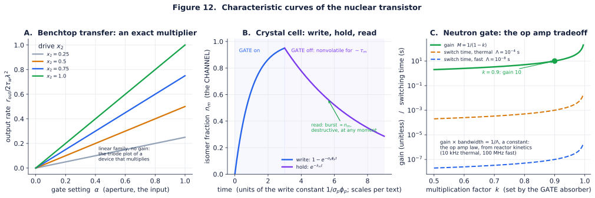

# The reference transistor: one unit of this computer, held in your hand

Every computing technology earns belief at the moment it can point to its unit: the one physical object that switches, stores, and can be tiled into a machine. For electronics that object is the transistor. This document is the answer to "what is yours?", and it gives the answer three times, because the same schematic exists today at three scales: a benchtop cell you could assemble this month from catalog parts, a crystal cell that is the program's target, and a reactor scale cell that already exists and proves the schematic closes. One drawing, three sizes ([figure 10](../figures/fig10_nuclear_transistor.svg)).

The unit is deliberately named a transistor and not a gate: a transistor is a *terminal device*. What makes a MOSFET buildable is not its physics but its pinout, the discipline of gate, source, drain, channel, and body. The claim of this document is that the nuclear cell has the same pinout.

## The pinout

| terminal | MOSFET | benchtop cell (today) | crystal cell (target) | neutron gate (proven) |
|---|---|---|---|---|
| **GATE** (control) | gate voltage | aperture position $\alpha$ | 148.38 nm trigger beam | control absorber position |
| **SOURCE** (supply) | supply rail | ¹³⁷Cs disk, 1 µCi | pump laser + source bath | driver source and neighbor leakage |
| **DRAIN** (output) | drain current | coincidence rate out | 8.4 eV fluorescence burst | leakage flux to next region |
| **CHANNEL** (state) | inversion charge | encoded rate $x\lambda$ | isomer fraction $n_m$ | neutron population |
| **BODY** (substrate) | silicon | scintillator volume | CaF₂ lattice | moderator block |
| **gain** | transconductance | none ($\beta \approx 1$) | **the empty socket: the keystone** | $1/(1-k)$, proven |

Read the last row left to right and you have the entire research program in one line: the benchtop cell works without gain, the crystal cell is complete except for the one socket this repository exists to fill, and the neutron gate has had gain since 1942.

## The analogy is load bearing

A fair objection: pinout tables are cheap, and "gate, source, drain" could be decoration. The test of an analogy is whether the *secondary* concepts of the original, the ones nobody chooses, map without forcing. They do, and each mapping is a measured quantity:

| MOSFET concept | nuclear counterpart | where it is measured |
|---|---|---|
| threshold voltage $V_{th}$ | the resonance condition: a channel conducts when tuned on line | every Mössbauer spectrum ever taken |
| **body effect** (substrate bias shifts $V_{th}$) | the **isomer shift**: electron density at the nucleus moves the resonance energy with host chemistry | the standard observable of Mössbauer chemistry, tabulated for decades |
| subthreshold leakage | spontaneous decay $\lambda_m$: the channel conducts a little even with no gate drive | the leak condition of the keystone criterion |
| gate charge (fluence to switch) | pump fluence to write $n_m$ | the write curve, figure 12 panel B |
| temperature derating | the Debye Waller factor $f(T)$: recoil free fraction falls with temperature | Mössbauer practice; the reason ⁵⁷Fe works at room temperature and heavier lines prefer cold |
| single event upset | **does not exist**: there is no bit to flip, a lost quantum moves a rate by one part in $N$ | theory Section 10.3 |
| gain bandwidth product | $M \cdot (1/\tau_{\text{switch}}) = 1/\Lambda$, a constant, for the subcritical gate | derived below; the op amp behavior, from reactor kinetics |

The body effect row deserves a sentence, because it is the sharpest: in silicon, the substrate's potential quietly shifts every threshold, and designers either fight it or exploit it. In the nuclear device the *chemical environment* does exactly this to every resonant channel, it is called the isomer shift, it has been measured to exquisite precision since 1960, and it is exploitable the same two ways: as a nuisance to be trimmed (the Zeeman coils) or as a free second knob (choosing the host compound chooses the operating point). An analogy that predicts the existence of an effect you then find in the other technology's textbooks is not decoration.

---

## Scale 1. The benchtop cell: a probabilistic bit you can order this month

This is the p bit of the stochastic tier, and nothing in it awaits a discovery.

**The object.** An aluminum box the size of a deck of cards. Inside, in a line: a license exempt 1 µCi ¹³⁷Cs disk source (within the 10 CFR 30.71 Schedule B exempt quantity; about $120 from any isotope supplier), a tungsten shutter on a hobby servo (the thinning aperture, the GATE), a short lead collimator (the fixed weights), and two 10 mm cubes of EJ-200 plastic scintillator, each read by a silicon photomultiplier (the BODY and the readout). Per cell, about $300 to $400 in parts; the only shared infrastructure is a discriminator and counter, which in the first version is ordinary boundary electronics.

**The operation.** The disk emits its 662 keV line (via ¹³⁷ᵐBa) as a Poisson stream at $3.7\times10^4$ decays per second. The shutter thins it to $x\lambda$: the CHANNEL state is a rate, set mechanically, exactly the thinning theorem of Appendix B.1. Two cells aimed at a shared scintillator volume with a 100 ns coincidence window form the multiplier of the gate set; the survival form of that gate is verified to 0.4 percent in [/transport](../transport/results.md). Feed the discriminated output back to the next cell's servo and the network is the sampler of [/simulator](../simulator/results.md).

**The numbers.** At a thinned proposal rate of $10^4$ per second and the measured 26 decays per independent sample, one cell contributes about **385 independent samples per second**. An eight cell machine reproducing the digital twin instance fits in a briefcase and costs about $3000. It is slow, honest, and real: every random number in it was manufactured by a nucleus.

**What is electronics and what is not.** In this version the weighted sum is geometry, the randomness is nuclear, the state is a rate, and the threshold is a discriminator at the boundary. The purity claim of the charter is staged, not violated: each successive version pushes the boundary outward, and the document says so plainly.

**The recurrence loop, specified.** The feedback that makes cells a sampler rather than a calculator is one control law per site, executed on a fixed cycle:

1. count the site's coincidence volume for a window $T_{\text{loop}}$, yielding $n_k$;
2. form the drive $u_k = (n_k - n_0)/s$, with offset and scale set once at calibration (they encode the site's bias and the weight normalization);
3. set the site's aperture to **duty** $\sigma(u_k)$ for the next window: the shutter dwells open that fraction of the cycle, a pulse width modulated Gibbs acceptance.

The timing closes on itself: at a thinned input rate of $10^4$ per second and 4 bit drive resolution, the precision law sets $T_{\text{loop}} = 2^{2b}/r \approx 26$ ms, which is a 40 Hz loop, which is exactly a hobby servo's natural cadence. Quantized acceptance biases the sampled law by an amount bounded by the quantization step (the variance calculus of theory Section 10.1 prices it); 4 bits is ample for annealing. Two implementations, honestly ranked: **Mode A** (the working mode): a boundary counter and lookup table drive the servos at up to kHz, electronics touching only counts and servo commands, never quanta in flight. **Mode B** (the demonstration mode): the duty table is printed and a clockwork cam or a patient human executes it at tenths of hertz, proving the loop contains no essential silicon, at a pace that makes the point and nothing else. Electronics free recurrence at speed is precisely what the valve fabric ([VALVE.md](VALVE.md)) and the keystone are for.

## Between the scales: the valve, or why "field effect" is not a metaphor

Before the crystal cell, one device deserves its own heading because it exists today and is usually overlooked: put a resonant absorber foil (⁵⁷Fe, or ¹⁸¹Ta for sensitivity) in a beam from its matched parent source, and wrap it in a coil. The foil transmits when detuned and blocks when on line; the coil's field moves the line (0.7 linewidths per tesla for ⁵⁷Fe, 42 for ¹⁸¹Ta); therefore **current in a coil gates a γ ray stream**. That is a field effect device in the literal sense of both words: a field, effecting conduction in a channel, at 14.4 keV. A piezoelectric Doppler mount does the same job kinematically at kHz to MHz rates, and has since the 1960s in every Mössbauer laboratory on Earth, where it is called a drive and never called what it is: a modulator terminal on a nuclear valve.

The valve is a *pass* transistor: it switches and routes but does not amplify ($\beta = 1$, and conversion and recoil free losses make it lossy in practice). Its switching time is set by the line's response (the 98 ns ⁵⁷Fe lifetime; microseconds for coil inductance). Every ingredient is catalog physics, which makes the valve the correct first hardware milestone for the *logic* story, as the benchtop cell is for the *sampling* story: a demonstrated GATE terminal, waiting for its gain.

## Scale 2. The crystal cell: the target device

This is the cell the whole program is trying to reach, and every part of it except one has been demonstrated somewhere.

**The object.** A millimeter scale crystal of CaF₂, transparent to its own working wavelength, doped with ²²⁹Th at $10^{17}$ to $10^{18}$ nuclei per cm³ (the doping already achieved in the crystals used for the 2024 nuclear clock measurements). There are no wires in it, no junctions, no lithography. The device structure is *optical*: focused beams define where the cells are.

**The register.** One cell is a voxel of the crystal about $(10\ \mu\text{m})^3$, containing $10^8$ to $10^9$ ²²⁹Th nuclei. The CHANNEL variable is the isomer fraction $n_m$ of that ensemble: an analog value, held without refresh for the isomer lifetime (about 630 s fluorescence lifetime in crystal; 1740 s half life in vacuum). By the precision law, a full destructive read of $10^8$ nuclei supports at most $\tfrac12\log_2 10^8 \approx 13$ bits of analog depth per voxel; that is an upper bound at perfect collection, and it is the honest unit of capacity for this machine.

**The terminals.** The GATE is a focused 148.38 nm VUV beam: pump fluence writes $n_m$ (demonstrated, 2024), a trigger or dump pulse releases it, and the resulting 8.4 eV fluorescence burst, proportional to $n_m$, is the DRAIN, guided by the crystal itself toward the next voxel or the boundary. Addressing is by position (beam waist, micrometers) and by energy (different dopant isotopes resonate at cleanly separated lines in the same voxel: spectral addressing, with no electronic analog).

**The two honest gaps.** First, writing speed: today's microwatt class VUV sources excite only trace populations, which suffices for rate encoded signaling but not for filling the 13 bit analog depth in useful time; milliwatt class 148 nm generation is an engineering gap, not a physics gap. Second, the gain socket: this cell is a nonvolatile memory and a soft threshold neuron with $\beta \approx 1$. It cannot drive successors. The socket where transconductance belongs is exactly the keystone of the main document, and the cell is drawn with that socket visibly empty because drawing it filled would be a lie.

## Scale 3. The neutron gate: the cell that already exists

**The object.** A moderated region containing fissile material (²³⁵U, or ²⁴²ᵐAm, the one entry that is simultaneously an isomer and a proven gain medium), kept strictly subcritical at, say, $k = 0.9$. It is the size of a washing machine and wants a license, shielding, and an institution.

**The terminals.** The control absorber is the GATE, programmable by position. Neutrons arriving from the driver source and from neighboring regions are the SOURCE. The multiplied leakage flux to the next region is the DRAIN. The circulating neutron population is the CHANNEL, and the moderator is the BODY. The gain is $M = 1/(1-k) = 10$ at $k = 0.9$: real transconductance, tabulated in ENDF to four digits, with level restoration built in because fission neutrons are born fast regardless of what triggered them. Clocking is set by the prompt generation time: about $10^{-4}$ s in thermal assemblies, about $10^{-8}$ s in fast ones.

**The gain bandwidth theorem.** Subcritical kinetics gives the response time of the multiplied population as $\tau_{\text{switch}} \approx \Lambda/(1-k) = \Lambda M$ (prompt approximation; delayed neutron precursors slow the approach further as $k \to 1$, which only strengthens the point). Therefore

$$ M \cdot \frac{1}{\tau_{\text{switch}}} \;=\; \frac{1}{\Lambda}, $$

a **constant gain bandwidth product**, exactly the signature behavior of an operational amplifier, falling out of 1950s reactor kinetics: about **10 kHz for thermal assemblies and 100 MHz for fast ones**. Want ten times the gain, pay ten times the switching time; trade along the curve freely; the product is fixed by the physics of the BODY (the moderator sets $\Lambda$). Figure 12, panel C, draws the whole tradeoff. No stronger evidence exists that the transistor framing is the machine's native language: the analogy did not merely survive contact with reactor kinetics, it *predicted the op amp law hiding inside it*.

**Why it is in this document.** Not as a proposal; nobody wants this computer. It is here because a skeptical reader's strongest objection to the crystal cell ("no such device has ever existed") is answered by pointing at this one: the same pinout, with the gain socket filled, has operated on Earth since 1942, and operated *unattended* at Oklo two billion years before that. The crystal cell is that device shrunk by seven orders of magnitude, minus, so far, its gain.

---

## The datasheet

Every parameter below is either computed from constants already cited in this repository or marked with its assumption; figure 12 draws the characteristic curves.

| parameter | benchtop cell | crystal cell | neutron gate |
|---|---|---|---|
| transfer function | $r_{\text{out}} = 2\tau_w r_1 r_2$: an exact multiplier, linear family (fig. 12A) | write: $n_m = 1 - e^{-\sigma_p \phi_p t}$; read burst $\propto n_m$ (fig. 12B) | $M = 1/(1-k)$, hyperbolic transconductance (fig. 12C) |
| gain | none ($\beta \approx 1$) | none yet: the empty socket | $1/(1-k)$; 10 at $k=0.9$ |
| switching time | ms (servo aperture) | µs (Doppler) to ns (line response); write time $1/\sigma_p\phi_p$ | $\Lambda/(1-k)$: gain bandwidth product $1/\Lambda$ |
| retention | none (rates are live) | 630 s in crystal; the catalog ladder above | not a memory |
| units per liter | ~10 | ~$10^{12}$ (10 µm voxel pitch) | ~$10^{-2}$ |
| bits per unit | rate to precision law depth | ~13 analog bits per $10^8$ nucleus voxel | 1 (fired or not, per clock) |
| energy per switch | one decay per proposal | 8.4 eV per quantum + pump overhead | grotesque; see the energy honesty section |
| drift | none if degree homogeneous (theory 7) | $\lambda_m$ leak, priced by the criterion | none while driven |

Fourteen orders of magnitude of packing density separate the three embodiments of one schematic, which is the miniaturization program stated as a single row of a table.

**Absolute maximum ratings** (exceeding any of these does not damage the analogy; it damages the machine):

- *Benchtop*: pile up above $\sim 10^6$ counts per second per scintillator channel (events merge, information is destroyed, THEORY.md 3.2); scintillator radiation darkening at industrial doses.
- *Crystal*: VUV solarization and color center formation in CaF₂ under prolonged 148 nm load (a known nuisance in the clock community's crystals); dopant densities above $\sim 10^{18}$ cm⁻³ degrade the lattice; Debye Waller derating at elevated temperature for any Mössbauer channel in the trim fabric.
- *Neutron*: $k < 1$ with engineered margin, always, everywhere, with negative temperature coefficients: this row is a law, not a spec.

---

## What you would actually see

A visitor looking at the finished crystal machine would see a lead lined box holding a fingernail sized crystal, two or three laser feeds entering through windows, and a detector ring at the boundary. Nothing moves. There is no hum. The entire computation, the weighted sums flowing through the Green's function, the isomer registers filling and dumping, the coincidence multiplications, is photon traffic inside the crystal, invisible and silent, paid for by a decay budget. The benchtop version is the same idea a visitor can watch: servos clicking apertures, scintillators flashing faintly in the dark, a counter ticking off samples that no pseudorandom generator anywhere had to fake.

*The pinout is the argument, and the datasheet is the proof that the pinout is native: the body effect was already in the Mössbauer textbooks as the isomer shift, the field effect was already on every laboratory bench as the Doppler drive, and the op amp's constant gain bandwidth product was already hiding in reactor kinetics as $1/\Lambda$. If a device has a gate, a source, a drain, a state, and a substrate, it can be tiled; if one of the three embodiments above already runs with gain, the question is not whether this machine can exist, but at what scale it must.*

---

## Notes accompanying this reference design

Six companion notes extend the unit to its consequences, and stay subordinate to it:

- [SEALED.md](SEALED.md): **the machine note**, the ampoule, a sealed self sustaining vessel built from these units, every number computed by [`sealed_unit.py`](sealed_unit.py) into [`sealed_results.md`](sealed_results.md) and figure 11;
- [EMBODIMENT.md](EMBODIMENT.md): **the build note**, the ampoule at assembly grade: shell by shell dimensions and materials, the assembly sequence, commissioning, the operating procedure, and failure modes;
- [VALVE.md](VALVE.md): **the logic note**, the field effect γ ray valve as a specified device, an algebra (series is AND of openness, parallel is OR, velocity offsets multiplex one sight line), and a modulator;
- [COMPONENTS.md](COMPONENTS.md): **the inventory note**, every component of a working computer mapped to its nuclear implementation with an honest status word, the missing ones simulated (figure 13), and the modulated glow as the output row;
- [POWER.md](POWER.md): **the metabolism note**, the five conversion chains that feed the periphery while the compute core eats decays raw, with load matching;
- [SCALING.md](SCALING.md): **the trajectory note**, the ENIAC ledger of how each part of the unit improves, on whose budget, toward which ceiling.

Figure scripts, all deterministic, all run in CI: [`make_transistor_figure.py`](make_transistor_figure.py) (figure 10), [`make_datasheet_figure.py`](make_datasheet_figure.py) (figure 12).
